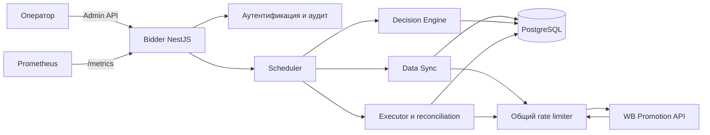
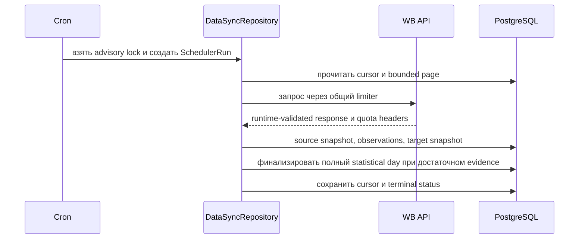
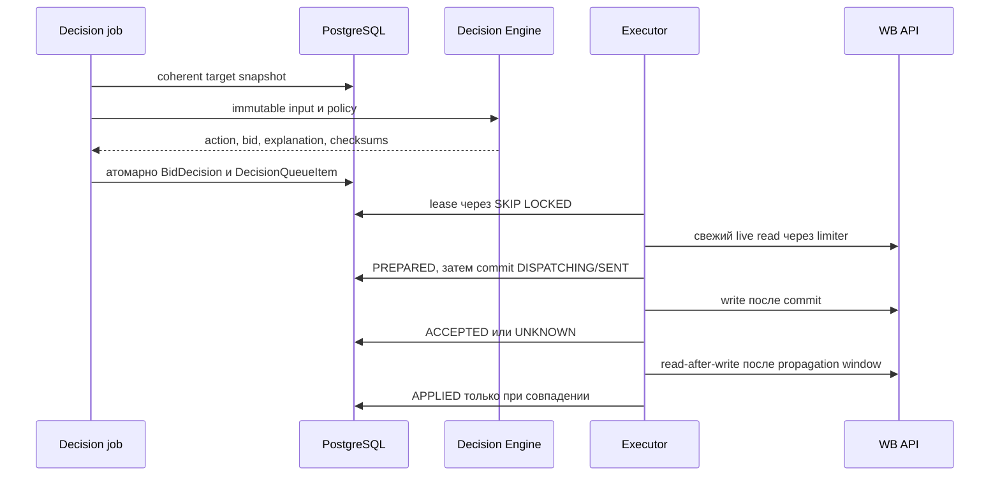
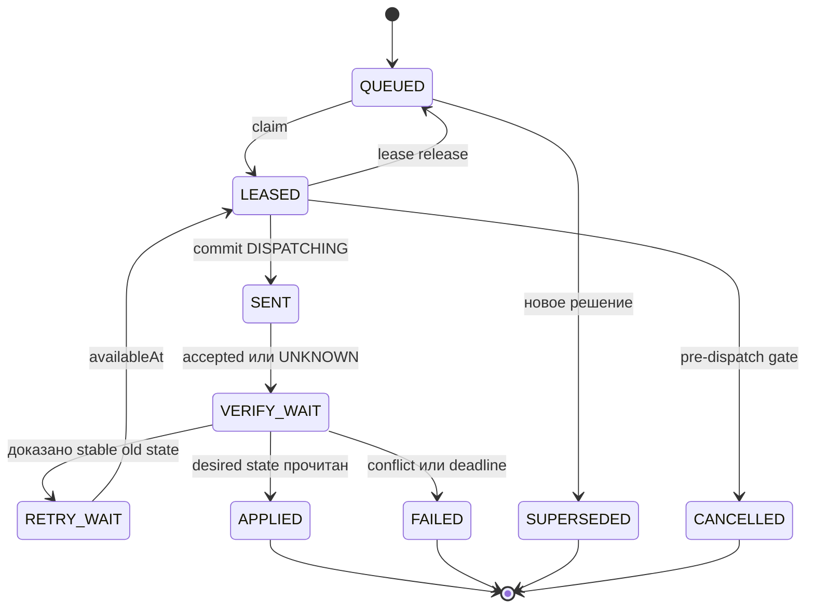

# Архитектура WB Bidder

WB Bidder — self-hosted deployment для одного продавца. PostgreSQL является источником истины,
WB API — внешним наблюдаемым и изменяемым контуром, а Decision Engine остаётся чистой
детерминированной библиотекой. Mock входит только в тестовую топологию.

## Компоненты

Bidder запускает независимые jobs: быстрый current-state sync, медленный data sync, расчёт,
применение, verification/reconciliation, experiment lifecycle, imports, manual jobs и retention.
Каждый job имеет PostgreSQL advisory lock; несколько реплик не выполняют один run одновременно.

## Последовательность синхронизации

`CURRENT_STATE_SYNC` не зависит от медленной статистики. Cursor сохраняется только после
обработки страницы; deadline и freshness failures закрывают `APPLY`, но Admin API остаётся
доступным.

## Решение и применение

Ни один сетевой write не выполняется до durable commit `DISPATCHING`. Timeout/`5xx` после этой
границы становится `UNKNOWN`; новый write возможен только после двух разнесённых стабильных
чтений старого состояния и полной повторной валидации.

## Машина состояний очереди

## Границы безопасности

- Один deployment привязан к одному `sellerSid`, currency, timezone, environment и token type.
- Production URL фиксирован официальным HTTPS origin; redirect и userinfo запрещены.
- Все деньги хранятся как `BIGINT` minor units, ratios — как точные rational/ppm.
- Write требует одновременно configuration, token, binding, capacity, integration, policy,
  capability, automation и kill-switch gates.
- Неподтверждённый wire-контракт никогда не включает write capability.

Связанные документы: [модель данных](data-model.md), [синхронизация](data-synchronization.md),
[алгоритм](bidding-algorithm.md), [write pipeline](write-pipeline.md) и [runbook](runbook.md).
