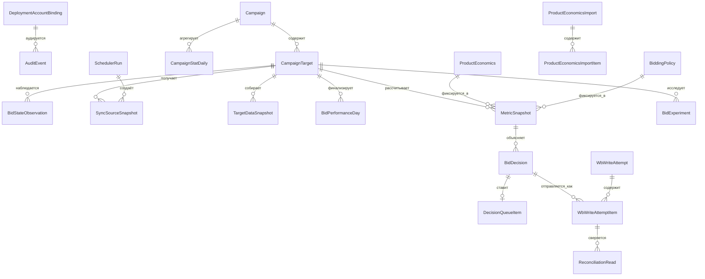
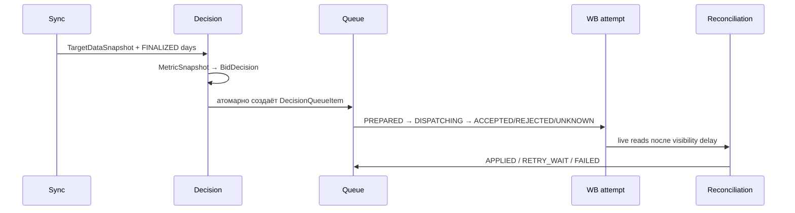

# Модель данных

## Какой вопрос отвечает модель данных

Эта модель описывает память системы: какие факты она получила от WB, какие бизнес-правила
действовали, что решил алгоритм и как было доказано применение ставки. Она не является схемой
данных Wildberries. Основные сущности — campaign, target, snapshot, policy, decision и queue —
введены в [путеводителе](project-guide.md#главные-понятия); сквозная причина их разделения — в
[архитектуре](architecture.md).

Большинство записей ниже версионируются или неизменяемы. Это значит, что новая экономика или
policy не переписывает прошлый расчёт: можно восстановить входы, причину и последствия каждого
решения. Цена этого выбора — больше исторических строк и необходимость retention-процедур;
выгода — аудит и отсутствие «тихой» смены основания для уже поставленной в очередь ставки.

Схема [`prisma/schema.prisma`](../prisma/schema.prisma) — единственный источник истины для
PostgreSQL. Она хранит бизнес-состояние, исходные данные, доказательства расчёта, решения и
попытки записи отдельно. Внутренние ключи — UUID, WB идентификаторы и деньги — `BIGINT`, даты
статистики — `DATE`, операционное время — `TIMESTAMPTZ(3)`, semantic checksums — 64-символьный
SHA-256. `Json` хранит версионированные payloads, которые нельзя без потерь выразить колонками.

Ниже слово «неизменяемый» означает, что приложение создаёт новую версию вместо изменения
семантики существующей записи; триггеры миграций дополнительно защищают snapshots, decisions,
audit и закрытые версии. Все показанные связи используют `onDelete: Restrict`: история не должна
исчезать каскадно.

## ER-поток и правила ссылочной целостности

## Перечисления

| Enum                       | Значения и смысл                                                                                                                                                                                                    |
| -------------------------- | ------------------------------------------------------------------------------------------------------------------------------------------------------------------------------------------------------------------- |
| `WbEnvironment`            | `MOCK`, `SANDBOX`, `PROD` — контур привязки аккаунта.                                                                                                                                                               |
| `WbTokenType`              | `BASE`, `PERSONAL`, `TEST` — проверенный тип WB token.                                                                                                                                                              |
| `CampaignBidType`          | `MANUAL`, `UNIFIED`, `UNKNOWN`; `CampaignPaymentType` — `CPM`, `CPC`, `UNKNOWN`.                                                                                                                                    |
| `CampaignTargetKind`       | `CARD` или `CLUSTER`; `CampaignPlacement` — `COMBINED`, `SEARCH`, `RECOMMENDATIONS`.                                                                                                                                |
| `ClusterBidState`          | `EXPLICIT`, `ABSENT`, `UNKNOWN` — состояние cluster override.                                                                                                                                                       |
| `PerformanceDayStatus`     | `DRAFT`, `FINALIZED`, `SUPERSEDED`, `INVALID` — зрелость дневных данных.                                                                                                                                            |
| `ExternalWriteControlMode` | `EXCLUSIVE` либо `SHARED`: нужен для доказательства непрерывности наблюдения.                                                                                                                                       |
| `ProductEconomicsSource`   | `MANUAL` или `IMPORT`; `ImportStatus` — `QUEUED`, `PROCESSING`, `COMPLETED`, `COMPLETED_WITH_ERRORS`, `FAILED`; `ImportItemStatus` — `PENDING`, `PROCESSING`, `VALIDATED`, `SUCCEEDED`, `FAILED`.                   |
| `PolicyScope`              | `DEPLOYMENT`, `CAMPAIGN`, `TARGET`; `ExecutionMode` — `APPLY` или `OBSERVE_ONLY`.                                                                                                                                   |
| `DecisionAction`           | `NO_CHANGE`, `INCREASE`, `DECREASE`, `RESTORE_ABSENT_OVERRIDE`, `BLOCKED`.                                                                                                                                          |
| `ExperimentStatus`         | `PLANNED`, `ACTIVE`, `COLLECTING`, `EVALUATING`, `REVERTING`, `ACCEPTED`, `REVERTED`, `REVERT_CONSTRAINED`, `FAILED`, `FAILED_REVERT_BLOCKED`, `CANCELLED`.                                                         |
| `DecisionQueueStatus`      | `QUEUED`, `LEASED`, `SENT`, `VERIFY_WAIT`, `RETRY_WAIT`, `APPLIED`, `FAILED`, `SUPERSEDED`, `CANCELLED`.                                                                                                            |
| `WriteAttemptStatus`       | `PREPARED`, `DISPATCHING`, `ACCEPTED`, `REJECTED`, `UNKNOWN`; `WriteAction` — `SET`/`DELETE`; `DesiredBidState` — `EXPLICIT`/`ABSENT`; `ReconciliationStatus` — `NOT_REQUIRED`, `PENDING`, `CONFIRMED`, `MISMATCH`. |
| `SchedulerRunStatus`       | `RUNNING`, `SUCCEEDED`, `PARTIAL`, `FAILED`, `DEADLINE_EXCEEDED`.                                                                                                                                                   |
| `AutomationMode`           | `DISABLED`, `OBSERVE_ONLY`, `APPLY`; действует на deployment/campaign/target.                                                                                                                                       |
| `ManualJobStatus`          | `QUEUED`, `RUNNING`, `SUCCEEDED`, `FAILED`, `CANCELLED`.                                                                                                                                                            |
| `SyncDataKind`             | `CAMPAIGN_DISCOVERY`, `CAMPAIGN_DETAILS`, `CURRENT_BID`, `MINIMUM_BID`, `CAMPAIGN_STATISTICS`, `CLUSTER_LIST`, `CLUSTER_STATISTICS`, `BID_RECOMMENDATION`, `BUDGET_DIAGNOSTIC`, `SAME_DAY_SPEND`.                   |
| `SyncSnapshotStatus`       | `COMPLETE`, `INCOMPLETE`, `INVALID`, `STALE`.                                                                                                                                                                       |

## Аккаунт, кампании и текущая конфигурация

### `DeploymentAccountBinding`

Singleton-привязка первого авторизованного WB account. Поля `sellerSid`, `wbEnvironment`,
`tokenType`, `tokenCategory`, `tokenFor`, `tokenAccessFingerprint` фиксируют идентичность и
способ доступа; `accountCurrency`, `accountTimezone`, `accountSettingsSource`,
`accountSettingsChecksum` — неизменяемые настройки. `initializedAt`, `lastValidatedAt` и
`bindingVersion` дают временную и версионную трассировку. Уникальность `(sellerSid, wbEnvironment)`
не допускает вторую запись той же идентичности в контуре.

### `Campaign`

Одна строка на WB campaign: `id`, уникальный `wbCampaignId`, WB `type`/`status`, `bidType`,
`paymentType`, `name`, `wbChangedAt`, `lastSyncedAt`. Поля capability — `supported`,
`unsupportedReason`; источник details — `detailsFetchedAt`, `detailsChecksum`, `detailsSyncRunId`.
Связи ведут к targets, daily statistics, policy, source snapshots, automation и manual jobs.
Индекс `(status, supported)` обслуживает выбор активных поддерживаемых кампаний.

### `CampaignTarget`

Target принадлежит `campaignId`. Его естественный ключ — `nmId`, `targetKind`, `placement` и,
для cluster, `normQueryWire`/`normQueryCanonical`. Кэш текущего состояния: `currentBidMinor`,
`minimumBidMinor`, `lastConfirmedAt`, `currentBidChecksum`, `currentBidSyncRunId`,
`minimumBidConfirmedAt`, `minimumBidChecksum`, `minimumBidSyncRunId`, `capability`.

Cluster-поля `clusterBidState`, `clusterBidContractVersion`, `clusterBaselineBidState`,
`clusterBaselineBidMinor`, `clusterBaselineChecksum`, `clusterOverrideOwned` позволяют безопасно
создать и вернуть override. Связи охватывают все snapshots, days, metrics, decisions,
experiments, policy, automation, jobs и reconciliation reads. Индексы `(campaignId,nmId,targetKind,placement)`
и `lastConfirmedAt` поддерживают выбор и freshness.

### `BidStateObservation`

Неизменяемое наблюдение target в момент `observedAt`: ставка/cluster state, `campaignStatus`,
`bidType`, `paymentType`, `activePlacementConfig`, `configurationChecksum`, `sourceMarker`,
`syncRunId`, `externalWriteControlMode`, `changeMarkerObserved`. Уникальность
`(targetId, observedAt, configurationChecksum)` защищает один и тот же факт; индексы target/time
и run ID нужны для построения непрерывного режима.

## Первичные статистика и evidence

### `CampaignStatDaily`

Нормализованная сырая статистика WB: ссылка `campaignId`, WB IDs `wbCampaignId`/`nmId`,
`date`, optional `placement` и query, `appType`, `dimensions`, `views`, `clicks`, `atbs`,
`orders`, `orderedUnits`, `canceled`, `spendMinor`, `attributedRevenueMinor`. Provenance:
`fetchedAt`, `sourceVersion`, `sourceChecksum`, `syncRunId`, `normalizedAggregationKind`.
Уникальный ключ `(wbCampaignId,nmId,date,sourceVersion,appType)` сохраняет версии, а не
перезаписывает поздние данные; есть индексы campaign/date и run.

### `SyncSourceSnapshot`

Универсальный append-only payload каждого вызова синхронизации: `dataKind`, optional campaign/
target, `sourceDate`, `fetchedAt`, `endpointProfile`, `sourceChecksum`, `normalizedData`,
`valid`, `invalidReason`, `syncRunId`, `createdAt`. Индексы `(dataKind,fetchedAt)`,
`(targetId,dataKind,fetchedAt)` и `syncRunId` обеспечивают доказательство свежести и диагностику.

### `TargetDataSnapshot`

Сводит пригодность target для одного sync run: `status`, `requiredSourceVersions`,
`completenessFlags`, `oldestFetchedAt`, `coherentRegimeChecksum`, `applyEligible`,
`increaseEligible`, `inputChecksum`. Последний уникален, поэтому один и тот же набор evidence
не материализуется дважды. Индексы target/time и status/time обслуживают свежие snapshots.

### `BidPerformanceDay`

Финализированный материал для оценщика: target, `wbStatisticDate`, `statisticalDayProfile`,
`confirmedBidMinor`, `placementBidState`, campaign/payment/bid type, `activePlacementConfig`,
дельты views/clicks/atbs/orders/`orderedUnits`/spend/revenue, `orderedUnitsSource`.

Границы доказательства — `coverageStartedAt`, `coverageEndedAt`, `maxObservedGapMinutes`,
`externalWriteControl`, `changeMarkerCoverage`, `sourceSnapshotReferences`. Модель зрелости:
`statisticsFinalizedAt`, `conversionLagDays`, `status`, `supersededAt`, `qualityFlags`.
`inputChecksum` и `createdAt` завершают immutable версию. Уникальность
`(targetId, wbStatisticDate, inputChecksum)` допускает новую версию при late attribution;
индекс `(targetId, wbStatisticDate, status)` даёт текущие FINALIZED дни.

## Экономика и policy

### `ProductEconomics` и импорт

`ProductEconomics` — интервальная неизменяемая версия экономики товара: `nmId`,
`effectiveFrom`, `effectiveTo`, `expectedContributionBeforeAdsMinor`, `source`,
`sourceUpdatedAt`, `sourceReference`, `version`, уникальный `mutationKey`, `inputChecksum`,
создание и actor. Уникальны `(nmId,version)`; индекс `(nmId,effectiveFrom,effectiveTo)` выбирает
действующую версию. Пересечения периодов и изменение закрытых версий блокируются БД.

`ProductEconomicsImport` хранит batch lifecycle: status/dry-run, `(idempotencyScope,
idempotencyKey)` и `requestChecksum`, counters total/processed/validated/succeeded/failed,
lease, attempts/error, timestamps, actor/correlation/reason. Индекс `(status,createdAt)` берёт
следующую работу. `ProductEconomicsImportItem` хранит `rowId`, `nmId`, `normalizedInput`,
`rowChecksum`, status/error, expected/actual/current created versions. Уникальности
`(importId,rowId)` и `(importId,nmId)` не допускают дубль строки; индексы поддерживают прогресс
и cursor-пагинацию.

### `BiddingPolicy`

Версия policy привязана к `scope`, optional `campaignId`/`targetId`, `executionMode`, JSON
`configuration`, `enabled`, `version`, интервалу `validFrom`/`validTo`, checksum, созданию и
actor. Уникальность `(scope,campaignId,targetId,version)` разрешает append-only версии;
индекс scope/owner/validity выбирает наиболее специфичную действующую policy. В `configuration`
сериализуется полный `DecisionPolicy`, описанный в [алгоритме](bidding-algorithm.md).

## Расчёт, решение и эксперимент

### `MetricSnapshot`

Неизменяемый снимок входа алгоритма: `targetId`, optional economics ID/version/contribution,
`policyId`, календарный period, JSON `metrics` и `candidateEstimates`, `completenessFlags`,
`inputSnapshotChecksum`, `inputSnapshotSchema`, `algorithmVersion`, `calculatedAt`. Уникальность
`(targetId,inputSnapshotChecksum)` даёт идемпотентность; `(targetId,calculatedAt)` — историю.

### `BidDecision`

Материализованный `DecisionResult`: UUIDv7 `id`, target, `action`, current/proposed/bounded bid,
strategy/outcome reasons, `guardrailCodes`, JSON `explanation`, metric snapshot, `policyVersion`,
`algorithmVersion`, уникальный `decisionInputChecksum`, `createdAt`. Один decision может иметь
ровно ноль или один queue item и много attempt items. Индекс target/time строит историю решений.

### `BidExperiment`

Состояние lower-only experiment: target/status, `sourceBidMinor`, `experimentBidMinor`,
`desiredRevertBidMinor`, optional `actualRevertBidMinor`; `plannedFullDays`,
`collectedEligibleDays`; `spendLimitMinor`, `spendSafetyBufferMinor`, observed/reserved spend;
start/first/last/evaluation timestamps; policy/algorithm/reason/terminal reason; ссылки на
result/start/revert decision; revert и lease timestamps; created/completed. Индекс
`(targetId,status)` находит активные эксперименты; частичный уникальный индекс миграции запрещает
более одного non-terminal experiment на target.

## Очередь, удалённая запись и сверка

### `DecisionQueueItem`

Один decision имеет уникальный `decisionId`. Строка хранит status, priority, `availableAt`,
lease, counters попыток/verification, последнюю ошибку/HTTP, sent/verified/next verification/
reconciliation deadline, stable read checksum/count/time, manual retry block, failure class и
optimistic `version`. Индексы `(status,availableAt,priority)` и `leaseUntil` поддерживают
`FOR UPDATE SKIP LOCKED`, recovery и fair dispatch.

### `WbWriteAttempt` и `WbWriteAttemptItem`

`WbWriteAttempt` — один сетевой batch: endpoint/method, correlation/WB request IDs, request
checksum, batch size, status, prepare/dispatch/complete times, latency, предзаписное состояние,
HTTP/rate headers, redacted request/response digests, error class/code. Индекс `(status,preparedAt)`
находит зависшие `PREPARED`/`DISPATCHING`.

Каждый `WbWriteAttemptItem` связывает attempt и decision, сохраняет `requestIndex`, endpoint
target key, action/desired state/sent bid/wire value, attempt number, item HTTP/error/fragment
hash, reconciliation state/timestamp, pre-write evidence и desired checksum. Уникальности
`(attemptId,decisionId)` и `(decisionId,attemptNumber)` защищают batch и retry; индекс
`(reconciliationStatus,reconciledAt)` выбирает ожидающие сверки.

`ReconciliationRead` — отдельный live read: attempt item/target, `readAt`, state checksum,
source marker, JSON state, classification, freshness и результат prevalidation. Индексы по
attempt/time и target/time позволяют доказать стабильное старое/желаемое/третье состояние.

## Управление, jobs, аудит и rate limits

`DeploymentControl` — singleton с `globalKill`, reason, version, updatedAt/by. `CampaignAutomation`
и `TargetAutomation` содержат уникальную связь с владельцем, `mode`, reason, version и actor/time;
наиболее строгая настройка закрывает write.

`ManualJob` хранит type/status/scope, optional campaign/target, request actor/correlation/time,
lease, completion, result/error. Индексы status/time и owner/status выбирают работу. `SchedulerRun`
фиксирует job type, start/end/deadline/status, counters/checkpoint/error summary и lease; индекс
`(jobType,status,startedAt)` — для мониторинга. `SyncCheckpoint` имеет один ключ `dataKind` и
содержит cursor, границы full pass, last success/oldest pending, processed/total и updated time.

`AuditEvent` append-only хранит actor/action/entity, before/after, correlation/causation и время;
индексы entity/time и correlation поддерживают расследование. `IdempotencyRecord` сохраняет scope,
ключ, request checksum, ответ и expiry; уникальность `(scope,idempotencyKey)` не даёт повторить
изменение с другим payload. `WbRateLimitBucket` — PostgreSQL token bucket: `bucketKey`,
`blockedUntilMs`, decimal `tokens`, `lastRefillAtMs`, `updatedAt`; таблица отображена на
`wb_rate_limit_bucket`.

## Жизненный цикл и retention

`MetricSnapshot`, `BidDecision`, evidence versions, audit и попытки не заменяются новой
информацией: новая версия получает новый checksum/ключ. Retention job удаляет только завершённые
детали write attempts после `WB_WRITE_ATTEMPT_RETENTION_DAYS`; активные, `UNKNOWN`, ожидающие
reconciliation и failed rows не удаляются. Миграции применяются до запуска bidder и никогда не
удаляют рабочие данные автоматически.

## Трассировка реализации

Схема определена в `prisma/schema.prisma`, ограничения — в `prisma/migrations/`. Репозитории
`packages/data-sync/src/repository.ts`, `packages/decision-engine/src/repository.ts` и
`packages/write-pipeline/src/repository.ts` реализуют транзакции. Инварианты покрывают
`tests/integration/data-sync*.spec.ts`, `tests/integration/decision-engine.integration.spec.ts`,
`tests/integration/write-pipeline.integration.spec.ts`, `tests/unit/decision-engine*.spec.ts` и
`tests/contract/admin-api.contract.spec.ts`.

## Построчный справочник таблиц и столбцов

Этот раздел переводит Prisma-схему в язык предметной области. Каждая строка ниже описывает
**хранимую колонку**, а не параметр HTTP API. Поля-ссылки (`…Id`) содержат внутренний UUID;
одноимённое поле relation в Prisma — удобная навигация ORM, отдельной колонки PostgreSQL оно не
создаёт. `createdAt` фиксирует появление факта, `updatedAt` — последнее штатное изменение
настройки; время WB (`wbChangedAt`, `fetchedAt`, `observedAt`) не взаимозаменяемо с ними.

### Привязка развёртывания — `DeploymentAccountBinding`

Одна строка описывает, к какому кабинету WB относится весь deployment. Её создаёт стартовая
проверка токена; последующая проверка может обновить только момент валидации и версию binding.
Несовместимое изменение валюты, часового пояса или продавца не «исправляется» этой строкой, а
останавливает запуск опасных jobs.

| Колонка                                            | Что именно хранит и зачем нужно                                                                                      |
| -------------------------------------------------- | -------------------------------------------------------------------------------------------------------------------- |
| `id`                                               | Внутренний UUID привязки; используется в аудите, хотя бизнес-идентичность задают seller и environment.               |
| `sellerSid`                                        | Идентификатор продавца, извлечённый из проверенного WB-токена; предотвращает работу с чужим кабинетом.               |
| `wbEnvironment`                                    | Контур `MOCK`, `SANDBOX` или `PROD`; не даёт смешать тестовые и реальные данные.                                     |
| `tokenType`, `tokenCategory`, `tokenFor`           | Проверенный тип, категория и необязательное назначение токена; runtime сравнивает их с разрешённым профилем API.     |
| `tokenAccessFingerprint`                           | Несеcretный отпечаток разрешений токена; фиксирует смену доступа без хранения самого токена.                         |
| `accountCurrency`, `accountTimezone`               | Валюта и часовой пояс кабинета; определяют единицы денег и границы статистического дня.                              |
| `accountSettingsSource`, `accountSettingsChecksum` | Откуда взяты настройки и SHA-256 их нормализованного вида; позволяют заметить drift, а не молча пересчитать историю. |
| `initializedAt`, `lastValidatedAt`                 | Когда binding создан и когда его последний раз подтвердил runtime.                                                   |
| `bindingVersion`                                   | Монотонная версия допустимого изменения binding; входит в контроль конкурентных и audit-проверок.                    |

### Кампания и её цели — `Campaign`, `CampaignTarget`

`Campaign` — локальная карточка рекламной кампании WB, обновляемая discovery/details sync.
`CampaignTarget` — единица решения: конкретный товар (`nmId`) и, при необходимости, конкретный
поисковый кластер/размещение. Поля текущей ставки — это быстрый проверенный кэш последнего
наблюдения, а не замена истории из `BidStateObservation`.

| Таблица / колонка                                                               | Что именно хранит и зачем нужно                                                                                                                   |
| ------------------------------------------------------------------------------- | ------------------------------------------------------------------------------------------------------------------------------------------------- |
| `Campaign.id`, `Campaign.wbCampaignId`                                          | Локальный UUID и уникальный внешний ID WB; первый связывает внутренние таблицы, второй — запросы к WB.                                            |
| `type`, `status`, `bidType`, `paymentType`, `name`                              | Тип, состояние, способ задания ставки, модель оплаты и имя кампании из WB; определяют поддержку и применимость алгоритма.                         |
| `wbChangedAt`, `lastSyncedAt`                                                   | Время изменения по версии WB и время нашего успешного чтения; различают внешний drift и свежесть локального кэша.                                 |
| `supported`, `unsupportedReason`                                                | Разрешено ли управлять этим типом кампании и конкретная причина запрета; unsupported кампания не попадёт в apply.                                 |
| `detailsFetchedAt`, `detailsChecksum`, `detailsSyncRunId`                       | Время, хэш и run подробного ответа; связывают capability с доказательством, а не с догадкой.                                                      |
| `CampaignTarget.id`, `campaignId`                                               | UUID target и обязательная ссылка на кампанию-владельца.                                                                                          |
| `nmId`, `targetKind`, `placement`                                               | Товар WB, вид цели (`CARD`/`CLUSTER`) и рекламное размещение; вместе задают контекст ставки.                                                      |
| `normQueryWire`, `normQueryCanonical`                                           | Исходный и нормализованный запрос кластера; первый нужен для точного WB wire-запроса, второй — для устранения эквивалентных написаний и коллизий. |
| `currentBidMinor`, `minimumBidMinor`                                            | Последняя подтверждённая текущая и минимально допустимая ставка в minor units; используются как кандидат и нижняя граница.                        |
| `lastConfirmedAt`, `currentBidChecksum`, `currentBidSyncRunId`                  | Время, хэш и sync-run текущей ставки; доказывают её свежесть и происхождение.                                                                     |
| `minimumBidConfirmedAt`, `minimumBidChecksum`, `minimumBidSyncRunId`            | Те же три свойства для минимальной ставки; не позволяют выдать старый minimum за актуальный.                                                      |
| `clusterBidState`, `clusterBidContractVersion`                                  | Наблюдаемое состояние cluster override и версия контракта WB, по которой оно разобрано; `UNKNOWN` закрывает изменение.                            |
| `clusterBaselineBidState`, `clusterBaselineBidMinor`, `clusterBaselineChecksum` | Состояние до нашего override и его хэш; нужны, чтобы корректно вернуть baseline, а не удалить чужую ставку.                                       |
| `clusterOverrideOwned`                                                          | Создан ли override этой системой; запрещает удалять override, принадлежащий внешнему оператору.                                                   |
| `capability`                                                                    | Итоговая capability target, например только наблюдение; её проверяет расчёт и pre-dispatch validator.                                             |

### Сырые факты и статистический день — `CampaignStatDaily`, `BidStateObservation`, `SyncSourceSnapshot`, `TargetDataSnapshot`, `BidPerformanceDay`

Эти таблицы разделяют пять уровней доверия: сырая нормализованная статистика, точечное
наблюдение состояния ставки, payload конкретного вызова, собранный набор достаточных источников
и финальный день для алгоритма. Нельзя подменять поздний `CampaignStatDaily` уже финализированным
`BidPerformanceDay`: новая версия должна быть создана отдельно и пометить старую `SUPERSEDED`.

| Таблица / колонка                                                                                             | Что именно хранит и зачем нужно                                                                                                                                          |
| ------------------------------------------------------------------------------------------------------------- | ------------------------------------------------------------------------------------------------------------------------------------------------------------------------ |
| `CampaignStatDaily.id`, `campaignId`                                                                          | UUID строки и ссылка на локальную кампанию, к которой отнесена статистика.                                                                                               |
| `wbCampaignId`, `nmId`, `date`                                                                                | Внешняя кампания, товар и календарная дата WB; образуют измерение статистики до нормализации.                                                                            |
| `placement`, `normQueryWire`, `normQueryCanonical`, `appType`, `dimensions`                                   | Разрез размещения, кластера, приложения и прочих измерений WB; `dimensions` сохраняет нормализованные признаки, не потерявшиеся при агрегации.                           |
| `views`, `clicks`, `atbs`, `orders`, `orderedUnits`, `canceled`                                               | Счётчики показов, кликов, добавлений в корзину, заказов, единиц и отмен; nullable `views` означает, что источник не дал достоверное значение.                            |
| `spendMinor`, `attributedRevenueMinor`                                                                        | Расход и атрибутированная выручка в minor units; это факты WB, а не расчётная маржа.                                                                                     |
| `fetchedAt`, `sourceVersion`, `sourceChecksum`, `syncRunId`, `normalizedAggregationKind`                      | Когда и какой версией источника получена строка, её хэш, run и правило агрегации; позволяют воспроизвести и не перезаписывать late attribution.                          |
| `BidStateObservation.id`, `targetId`, `observedAt`                                                            | UUID, target и точный момент наблюдения; строят временной ряд состояний ставки.                                                                                          |
| `currentBidMinor`, `clusterBidState`                                                                          | Явная card-ставка и/или состояние cluster override, увиденные в этот момент.                                                                                             |
| `campaignStatus`, `bidType`, `paymentType`, `activePlacementConfig`                                           | Runtime-контекст ставки: статус кампании, типы торгов и активная конфигурация placement; выявляет смену режима между днями.                                              |
| `configurationChecksum`, `sourceMarker`, `syncRunId`                                                          | Хэш конфигурации, маркер версии WB и создавший sync-run; позволяют отличить два наблюдения одинакового времени.                                                          |
| `externalWriteControlMode`, `changeMarkerObserved`                                                            | Доказательство, что WB управляется исключительно нами или совместно, и был ли замечен внешний change marker; влияют на пригодность evidence.                             |
| `SyncSourceSnapshot.id`, `dataKind`                                                                           | UUID payload и его тип (campaign list, bid, statistics и т. п.); тип определяет ожидаемую схему и потребителя.                                                           |
| `campaignId`, `targetId`, `sourceDate`                                                                        | Необязательная локальная привязка и дата, к которой относится ответ; некоторые WB ответы относятся к кампании, а не target.                                              |
| `fetchedAt`, `endpointProfile`, `sourceChecksum`                                                              | Момент чтения, immutable профиль endpoint и хэш нормализованного ответа; основа freshness и проверки контракта.                                                          |
| `normalizedData`, `valid`, `invalidReason`, `syncRunId`, `createdAt`                                          | Безопасно нормализованный payload, результат валидации, причина invalid, run и время сохранения; invalid payload сохраняется для диагностики, но не становится evidence. |
| `TargetDataSnapshot.id`, `targetId`, `syncRunId`, `createdAt`                                                 | Материализация готовности одного target в одном run: UUID, владелец, run и момент создания.                                                                              |
| `status`, `requiredSourceVersions`, `completenessFlags`                                                       | Итог (`COMPLETE`/`INCOMPLETE`/…), точные версии требуемых источников и причины неполноты.                                                                                |
| `oldestFetchedAt`, `coherentRegimeChecksum`                                                                   | Самое старое чтение и хэш согласованного режима; не дают собрать в один расчёт несовместимые ответы.                                                                     |
| `applyEligible`, `increaseEligible`, `inputChecksum`                                                          | Можно ли применять вообще, можно ли именно повышать, и хэш всех входов для идемпотентности сборки.                                                                       |
| `BidPerformanceDay.id`, `targetId`, `wbStatisticDate`, `statisticalDayProfile`                                | UUID финального дня, target, дата WB и профиль границ дня/задержек, по которому он собран.                                                                               |
| `confirmedBidMinor`, `placementBidState`, `campaignStatus`, `paymentType`, `bidType`, `activePlacementConfig` | Ставка и состояние размещения, а также режим кампании, действовавшие в периоде; связывают результат с конкретным regime.                                                 |
| `viewsDelta`, `clicksDelta`, `atbsDelta`, `ordersDelta`, `orderedUnitsDelta`                                  | Дельты в течение дня, подаваемые оценщику вместо накопительных счётчиков.                                                                                                |
| `spendDeltaMinor`, `attributedRevenueDelta`, `orderedUnitsSource`                                             | Дневной расход, выручка и источник единиц (`SHKS` и т. п.); объясняют денежные и конверсионные показатели.                                                               |
| `coverageStartedAt`, `coverageEndedAt`, `maxObservedGapMinutes`                                               | Непрерывность наблюдения: начало, конец и худший разрыв; большой разрыв снижает доверие к дню.                                                                           |
| `externalWriteControl`, `changeMarkerCoverage`, `sourceSnapshotReferences`                                    | Режим управления ставкой, покрытие внешних изменений и ссылки на payloads; обеспечивают audit доказательства.                                                            |
| `statisticsFinalizedAt`, `conversionLagDays`, `status`, `supersededAt`, `qualityFlags`                        | Когда день зрел, какая задержка учтена, его состояние, когда заменён и список предупреждений качества.                                                                   |
| `inputChecksum`, `createdAt`                                                                                  | Хэш набора входов и время создания immutable версии дня.                                                                                                                 |

### Экономика, импорт и политика — `ProductEconomics`, `ProductEconomicsImport`, `ProductEconomicsImportItem`, `BiddingPolicy`

Экономика приходит от бизнеса, а не из WB: это ожидаемый вклад одного заказа до рекламы.
Импорт отделён от самих версий экономики, чтобы частичный batch не стал незаметной массовой
сменой финансовых предпосылок. Policy задаёт ограничение алгоритма и существует как версия,
а не изменяемый JSON «на месте».

| Таблица / колонка                                                                         | Что именно хранит и зачем нужно                                                                                                      |
| ----------------------------------------------------------------------------------------- | ------------------------------------------------------------------------------------------------------------------------------------ |
| `ProductEconomics.id`, `nmId`, `version`                                                  | UUID версии экономики, товар WB и порядковая версия для него.                                                                        |
| `effectiveFrom`, `effectiveTo`                                                            | Полуоткрытый период действия; позволяет выбрать экономику, действовавшую во время решения.                                           |
| `expectedContributionBeforeAdsMinor`                                                      | Ожидаемая маржа одного заказа до рекламного расхода в minor units; ключевой вход целевой функции.                                    |
| `source`, `sourceUpdatedAt`, `sourceReference`                                            | Ручной/импортный источник, его собственное время обновления и ссылка/объяснение происхождения.                                       |
| `mutationKey`, `inputChecksum`, `createdAt`, `createdByActor`                             | Идемпотентный ключ изменения, хэш входа, время и actor; защищают аудит от одинаковых или подменённых версий.                         |
| `ProductEconomicsImport.id`, `status`, `dryRun`                                           | UUID batch, его жизненный статус и признак режима без записи экономики.                                                              |
| `idempotencyScope`, `idempotencyKey`, `requestChecksum`                                   | Граница клиента, ключ повтора и хэш тела; одинаковый ключ с другим body не допускается.                                              |
| `totalItems`, `processedItems`, `validatedItems`, `succeededItems`, `failedItems`         | Счётчики прогресса batch; позволяют отличить обработку от валидации и фактического создания версий.                                  |
| `leaseOwner`, `leaseUntil`, `attemptCount`, `lastError`                                   | Кто временно исполняет импорт, срок lease, число попыток и последняя ошибка recovery.                                                |
| `createdAt`, `startedAt`, `finishedAt`, `createdByActor`, `correlationId`, `changeReason` | Временная и пользовательская трассировка массового изменения.                                                                        |
| `ProductEconomicsImportItem.id`, `importId`, `rowId`, `nmId`                              | UUID строки, batch-владелец, ID исходной строки и товар, для которого создаётся экономика.                                           |
| `normalizedInput`, `rowChecksum`                                                          | Нормализованные финансовые значения и их хэш; сохраняют именно то, что прошло проверку.                                              |
| `status`, `errorCode`, `errorDetail`                                                      | Текущий результат строки и объяснение ошибки без потери результата соседних строк.                                                   |
| `expectedCurrentVersion`, `actualCurrentVersion`, `createdVersion`, `createdAt`           | Версия, на которую рассчитывал клиент, реально увиденная версия, созданная версия и время; это optimistic concurrency для экономики. |
| `BiddingPolicy.id`, `scope`, `campaignId`, `targetId`                                     | UUID policy, её уровень и необязательный владелец; более конкретная policy перекрывает deployment-правило.                           |
| `executionMode`, `enabled`                                                                | `APPLY`/`OBSERVE_ONLY` и переключатель действия; policy может продолжать объяснять расчёт, не разрешая write.                        |
| `configuration`                                                                           | Полный versioned `DecisionPolicy`: лимиты, окно данных, бюджет, guardrails и параметры экспериментов.                                |
| `version`, `validFrom`, `validTo`, `inputChecksum`, `createdAt`, `createdByActor`         | Версия, период применимости, хэш, время и actor; делают выбор policy на момент решения воспроизводимым.                              |

### Расчёт, решение и эксперимент — `MetricSnapshot`, `BidDecision`, `BidExperiment`

Эти записи объясняют не только выбранную ставку, но и основание выбора. `MetricSnapshot` —
вход алгоритма, `BidDecision` — его неизменяемый выход, `BidExperiment` — отдельная машина
состояний контролируемого снижения. Ни одна из таблиц сама не отправляет запрос в WB.

| Таблица / колонка                                                                                           | Что именно хранит и зачем нужно                                                                                        |
| ----------------------------------------------------------------------------------------------------------- | ---------------------------------------------------------------------------------------------------------------------- |
| `MetricSnapshot.id`, `targetId`                                                                             | UUID вычисления и target, для которого подготовлены метрики.                                                           |
| `productEconomicsId`, `productEconomicsVersion`, `expectedContributionBeforeAdsMinor`                       | Точная версия экономики и скопированная маржа, использованная расчётом; copy защищает историю от будущей смены записи. |
| `policyId`, `periodStart`, `periodEnd`                                                                      | Выбранная policy и календарное окно наблюдений.                                                                        |
| `metrics`, `candidateEstimates`, `completenessFlags`                                                        | Вычисленные показатели, прогноз каждого кандидата ставки и ограничения полноты, переданные decision engine.            |
| `inputSnapshotChecksum`, `inputSnapshotSchema`, `algorithmVersion`, `calculatedAt`                          | Хэш и схема входа, версия алгоритма и момент вычисления; позволяют повторить результат тем же кодом/форматом.          |
| `BidDecision.id`, `targetId`, `metricSnapshotId`                                                            | UUIDv7 решения, его target и неизменяемый входной snapshot.                                                            |
| `action`, `currentBidMinor`, `proposedBidMinor`, `boundedBidMinor`                                          | Выбранное действие, исходная ставка, математически лучшая ставка и окончательная после bounds/guardrails.              |
| `strategyReasonCode`, `outcomeReasonCode`, `guardrailCodes`                                                 | Машиночитаемые причины стратегии, результата и все сработавшие ограничения для API/аудита.                             |
| `explanation`                                                                                               | Полное человеческое объяснение кандидатов, evidence и блокировок без повторного запуска расчёта.                       |
| `policyVersion`, `algorithmVersion`, `decisionInputChecksum`, `createdAt`                                   | Версии правил и кода, уникальный хэш входа и время решения; исключают duplicate decision.                              |
| `BidExperiment.id`, `targetId`, `status`                                                                    | UUID эксперимента, target и состояние жизненного цикла lower-only проверки.                                            |
| `sourceBidMinor`, `experimentBidMinor`, `desiredRevertBidMinor`, `actualRevertBidMinor`                     | Исходная, тестовая, желаемая и реально возвращённая ставки; последнее nullable до подтверждённого revert.              |
| `plannedFullDays`, `collectedEligibleDays`, `firstEligibleDate`, `lastEligibleDate`, `evaluationNotBefore`  | Плановый и набранный объём зрелых дней, границы выборки и самый ранний момент оценки.                                  |
| `spendLimitMinor`, `spendSafetyBufferMinor`, `observedExperimentSpendMinor`, `reservedUnobservedSpendMinor` | Лимит расхода, запас, уже увиденный и зарезервированный из-за задержки расход; защищают бюджет эксперимента.           |
| `startedAt`, `policyVersion`, `algorithmVersion`, `experimentReasonCode`, `terminalReasonCode`              | Старт, версии оснований, причина запуска и необязательная причина терминального исхода.                                |
| `resultDecisionId`, `startDecisionId`, `revertDecisionId`                                                   | Связи с решением-результатом, решением старта и решением возврата; позволяют пройти цепочку audit.                     |
| `revertStartedAt`, `revertDeadlineAt`, `leaseOwner`, `leaseUntil`, `createdAt`, `completedAt`               | Контроль безопасного revert, временное владение worker и границы жизненного цикла.                                     |

### Очередь, попытка записи и сверка — `DecisionQueueItem`, `WbWriteAttempt`, `WbWriteAttemptItem`, `ReconciliationRead`

Здесь хранится доказуемый путь от решения до наблюдаемого WB-состояния. Сначала появляется
queue item, затем durable `PREPARED`, затем `DISPATCHING` до сетевого вызова. Поэтому timeout
после dispatch оставляет расследуемую попытку, а не разрешает повторить write «на всякий случай».

| Таблица / колонка                                                                              | Что именно хранит и зачем нужно                                                                                            |
| ---------------------------------------------------------------------------------------------- | -------------------------------------------------------------------------------------------------------------------------- |
| `DecisionQueueItem.id`, `decisionId`                                                           | UUID очереди и уникальная ссылка на решение; одно решение не может быть отправлено двумя queue items.                      |
| `status`, `priority`, `availableAt`                                                            | Состояние, порядок обслуживания и ближайшее допустимое время обработки/retry.                                              |
| `leaseOwner`, `leaseUntil`                                                                     | Временное владение worker; после истечения другой worker безопасно подхватит работу.                                       |
| `attemptCount`, `verificationAttemptCount`                                                     | Число send и read-after-write попыток; ограничивают бесконечный retry.                                                     |
| `lastErrorClass`, `lastErrorCode`, `lastHttpStatus`                                            | Последняя классифицированная ошибка, код и HTTP статус для оператора и стратегии retry.                                    |
| `sentAt`, `verifiedAt`, `nextVerificationAt`, `reconciliationDeadlineAt`                       | Времена отправки, подтверждения, следующего чтения и конечный срок сверки.                                                 |
| `stableReadChecksum`, `stableReadCount`, `lastReconciliationReadAt`                            | Хэш и число одинаковых live reads, а также последний момент; доказывают stable old state перед retry.                      |
| `manualRetryBlocked`, `failureClassification`, `version`                                       | Запрет ручного повтора, итоговый класс отказа и optimistic-lock версия строки.                                             |
| `WbWriteAttempt.id`, `endpointKey`, `method`, `correlationId`, `wbRequestId`                   | UUID сетевого batch, endpoint/метод, наш correlation и необязательный ID WB для сквозной трассировки.                      |
| `requestChecksum`, `batchSize`, `status`                                                       | Хэш отправляемого batch, число items и стадия сетевой операции.                                                            |
| `preparedAt`, `dispatchCommittedAt`, `completedAt`, `latencyMs`                                | Времена durable подготовки, commit перед отправкой, результата и измеренная задержка.                                      |
| `preWriteReadAt`, `preWriteStateChecksum`, `preWriteSourceMarker`                              | Дата, хэш и версия live read перед write; доказывают, что pre-dispatch валидатор видел именно это состояние.               |
| `httpStatus`, `rateLimitHeaders`, `requestDigest`, `responseDigest`, `errorClass`, `errorCode` | Итог HTTP, квотные заголовки, redacted digests, класс и код ошибки без хранения секретного payload.                        |
| `WbWriteAttemptItem.id`, `attemptId`, `decisionId`, `requestIndex`, `endpointTargetKey`        | UUID элемента, batch/decision-владельцы, позиция в batch и точный ключ target во внешнем endpoint.                         |
| `action`, `desiredBidState`, `sentBidMinor`, `wireBidRaw`, `attemptNumber`                     | SET/DELETE, ожидаемое состояние, ставка в minor units, фактически сериализованное wire-значение и номер повторной попытки. |
| `status`, `httpStatus`, `errorCode`, `responseFragmentHash`                                    | Пер-item результат, потому что batch может завершиться частично.                                                           |
| `reconciliationStatus`, `reconciledAt`                                                         | Нужна ли/успешна ли сверка и когда она завершилась.                                                                        |
| `preWriteReadAt`, `preWriteStateChecksum`, `preWriteSourceMarker`, `preWriteState`             | Снимок состояния перед конкретным item, включая нормализованный JSON для расследования.                                    |
| `desiredStateChecksum`                                                                         | Хэш ожидаемого результата; reconciliation сравнивает с ним live read, а не с приблизительной строкой.                      |
| `ReconciliationRead.id`, `attemptItemId`, `targetId`, `readAt`                                 | UUID контрольного чтения, item/target-владельцы и момент чтения WB.                                                        |
| `stateChecksum`, `sourceMarker`, `state`                                                       | Хэш, версия источника и нормализованное прочитанное состояние.                                                             |
| `classification`, `fresh`, `prevalidationPassed`                                               | Это desired/old/third/invalid состояние, свежо ли оно и прошло ли повторную проверку перед дальнейшим действием.           |

### Управление, jobs, аудит и общие механизмы

Эти таблицы не участвуют в формуле прибыли, но определяют право на исполнение, воспроизводимость
операторских действий, повтор HTTP-запросов и общую квоту аккаунта.

| Таблица / колонка                                                                            | Что именно хранит и зачем нужно                                                                                                               |
| -------------------------------------------------------------------------------------------- | --------------------------------------------------------------------------------------------------------------------------------------------- |
| `DeploymentControl.id`, `globalKill`, `reason`, `version`, `updatedAt`, `updatedBy`          | Singleton глобального стоп-крана, причина, optimistic версия, время и actor изменения; `globalKill=true` закрывает writes во всём deployment. |
| `CampaignAutomation.id`, `campaignId`, `mode`, `reason`, `version`, `updatedAt`, `updatedBy` | Единственная настройка automation кампании: владелец, `DISABLED`/`OBSERVE_ONLY`/`APPLY`, обоснование и audit metadata.                        |
| `TargetAutomation.id`, `targetId`, `mode`, `reason`, `version`, `updatedAt`, `updatedBy`     | Такая же, но более приоритетная настройка конкретного target.                                                                                 |
| `ManualJob.id`, `type`, `status`, `scope`                                                    | UUID вручную запрошенной работы, её тип, состояние и JSON-область действия (параметры/job scope).                                             |
| `campaignId`, `targetId`, `requestedAt`, `requestedBy`, `correlationId`                      | Необязательные владельцы, момент и actor запроса, сквозной ID для audit/logs.                                                                 |
| `leaseOwner`, `leaseUntil`, `startedAt`, `finishedAt`, `result`, `errorCode`                 | Исполнитель, срок lease, времена, JSON-результат и код отказа manual job.                                                                     |
| `AuditEvent.id`, `actor`, `action`, `entityType`, `entityId`                                 | Неизменяемая запись: кто сделал что и с каким объектом.                                                                                       |
| `before`, `after`, `correlationId`, `causationId`, `createdAt`                               | Снимки до/после, ID запроса, породившего события ID и время; позволяют расследовать цепочку изменений.                                        |
| `SchedulerRun.id`, `jobType`, `startedAt`, `endedAt`, `deadlineAt`, `status`                 | Один запуск планировщика: тип, границы, deadline и терминальный/промежуточный статус.                                                         |
| `counters`, `checkpoint`, `errorSummary`, `leaseOwner`, `leaseUntil`                         | JSON прогресса, сохранённая точка, сводка ошибки и владение job для мониторинга/recovery.                                                     |
| `SyncCheckpoint.dataKind`                                                                    | Первичный ключ: вид синхронизации, для которого хранится ровно одна контрольная точка.                                                        |
| `cursor`, `fullPassStartedAt`, `fullPassCompletedAt`                                         | Нормализованный cursor и границы полного прохода; restart продолжает именно этот поток.                                                       |
| `lastSuccessAt`, `oldestPendingAt`, `processedCount`, `totalEstimate`, `updatedAt`           | Свежесть, самый старый необработанный факт, прогресс, оценка объёма и время изменения checkpoint.                                             |
| `IdempotencyRecord.id`, `scope`, `idempotencyKey`, `requestChecksum`                         | UUID, область API, ключ клиента и хэш тела; повтор того же изменения возвращает сохранённый результат, другой body блокируется.               |
| `responseStatus`, `responseHeaders`, `responseBody`, `createdAt`, `expiresAt`                | Кэшируемый HTTP-ответ и срок его безопасного хранения.                                                                                        |
| `bucketKey`                                                                                  | Ключ общего лимитного bucket (`WbRateLimitBucket`), обычно endpoint/аккаунт; делает лимит общим для реплик.                                   |
| `blockedUntilMs`, `tokens`, `lastRefillAtMs`, `updatedAt`                                    | Время 429-блокировки, доступные токены с дробной точностью, момент refill и техническое время обновления PostgreSQL token bucket.             |
