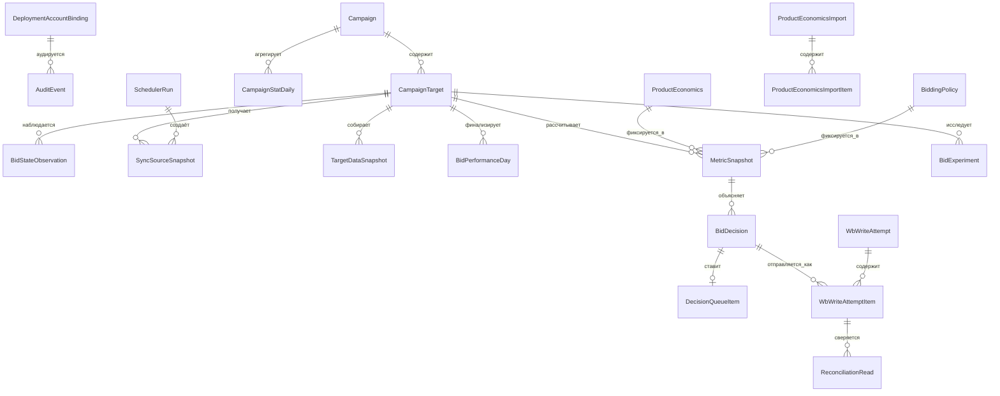
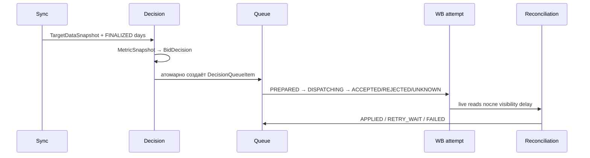

# Модель данных

## Какой вопрос отвечает модель данных

Эта модель описывает память системы: какие факты она получила от WB, какие бизнес-правила
действовали, что решил алгоритм и как было доказано применение ставки. Она не является схемой
данных Wildberries. Основные сущности — campaign, target, snapshot, policy, decision и queue —
введены в [путеводителе](project-guide.md#главные-понятия); сквозная причина их разделения — в
[архитектуре](architecture.md).

Большинство записей ниже версионируются или неизменяемы. Это значит, что новая экономика или
policy не переписывает прошлый расчёт: можно восстановить входы, причину и последствия каждого
решения. Цена этого выбора — больше исторических строк и необходимость retention-процедур;
выгода — аудит и отсутствие «тихой» смены основания для уже поставленной в очередь ставки.

Схема [`prisma/schema.prisma`](../prisma/schema.prisma) — единственный источник истины для
PostgreSQL. Она хранит бизнес-состояние, исходные данные, доказательства расчёта, решения и
попытки записи отдельно. Внутренние ключи — UUID, WB идентификаторы и деньги — `BIGINT`, даты
статистики — `DATE`, операционное время — `TIMESTAMPTZ(3)`, semantic checksums — 64-символьный
SHA-256. `Json` хранит версионированные payloads, которые нельзя без потерь выразить колонками.

Ниже слово «неизменяемый» означает, что приложение создаёт новую версию вместо изменения
семантики существующей записи; триггеры миграций дополнительно защищают snapshots, decisions,
audit и закрытые версии. Все показанные связи используют `onDelete: Restrict`: история не должна
исчезать каскадно.

## ER-поток и правила ссылочной целостности

## Перечисления

| Enum                       | Значения и смысл                                                                                                                                                                                                    |
| -------------------------- | ------------------------------------------------------------------------------------------------------------------------------------------------------------------------------------------------------------------- |
| `WbEnvironment`            | `MOCK`, `SANDBOX`, `PROD` — контур привязки аккаунта.                                                                                                                                                               |
| `WbTokenType`              | `BASE`, `PERSONAL`, `TEST` — проверенный тип WB token.                                                                                                                                                              |
| `CampaignBidType`          | `MANUAL`, `UNIFIED`, `UNKNOWN`; `CampaignPaymentType` — `CPM`, `CPC`, `UNKNOWN`.                                                                                                                                    |
| `CampaignTargetKind`       | `CARD` или `CLUSTER`; `CampaignPlacement` — `COMBINED`, `SEARCH`, `RECOMMENDATIONS`.                                                                                                                                |
| `ClusterBidState`          | `EXPLICIT`, `ABSENT`, `UNKNOWN` — состояние cluster override.                                                                                                                                                       |
| `PerformanceDayStatus`     | `DRAFT`, `FINALIZED`, `SUPERSEDED`, `INVALID` — зрелость дневных данных.                                                                                                                                            |
| `ExternalWriteControlMode` | `EXCLUSIVE` либо `SHARED`: нужен для доказательства непрерывности наблюдения.                                                                                                                                       |
| `ProductEconomicsSource`   | `MANUAL` или `IMPORT`; `ImportStatus` — `QUEUED`, `PROCESSING`, `COMPLETED`, `COMPLETED_WITH_ERRORS`, `FAILED`; `ImportItemStatus` — `PENDING`, `PROCESSING`, `VALIDATED`, `SUCCEEDED`, `FAILED`.                   |
| `PolicyScope`              | `DEPLOYMENT`, `CAMPAIGN`, `TARGET`; `ExecutionMode` — `APPLY` или `OBSERVE_ONLY`.                                                                                                                                   |
| `DecisionAction`           | `NO_CHANGE`, `INCREASE`, `DECREASE`, `RESTORE_ABSENT_OVERRIDE`, `BLOCKED`.                                                                                                                                          |
| `ExperimentStatus`         | `PLANNED`, `ACTIVE`, `COLLECTING`, `EVALUATING`, `REVERTING`, `ACCEPTED`, `REVERTED`, `REVERT_CONSTRAINED`, `FAILED`, `FAILED_REVERT_BLOCKED`, `CANCELLED`.                                                         |
| `DecisionQueueStatus`      | `QUEUED`, `LEASED`, `SENT`, `VERIFY_WAIT`, `RETRY_WAIT`, `APPLIED`, `FAILED`, `SUPERSEDED`, `CANCELLED`.                                                                                                            |
| `WriteAttemptStatus`       | `PREPARED`, `DISPATCHING`, `ACCEPTED`, `REJECTED`, `UNKNOWN`; `WriteAction` — `SET`/`DELETE`; `DesiredBidState` — `EXPLICIT`/`ABSENT`; `ReconciliationStatus` — `NOT_REQUIRED`, `PENDING`, `CONFIRMED`, `MISMATCH`. |
| `SchedulerRunStatus`       | `RUNNING`, `SUCCEEDED`, `PARTIAL`, `FAILED`, `DEADLINE_EXCEEDED`.                                                                                                                                                   |
| `AutomationMode`           | `DISABLED`, `OBSERVE_ONLY`, `APPLY`; действует на deployment/campaign/target.                                                                                                                                       |
| `ManualJobStatus`          | `QUEUED`, `RUNNING`, `SUCCEEDED`, `FAILED`, `CANCELLED`.                                                                                                                                                            |
| `SyncDataKind`             | `CAMPAIGN_DISCOVERY`, `CAMPAIGN_DETAILS`, `CURRENT_BID`, `MINIMUM_BID`, `CAMPAIGN_STATISTICS`, `CLUSTER_LIST`, `CLUSTER_STATISTICS`, `BID_RECOMMENDATION`, `BUDGET_DIAGNOSTIC`, `SAME_DAY_SPEND`.                   |
| `SyncSnapshotStatus`       | `COMPLETE`, `INCOMPLETE`, `INVALID`, `STALE`.                                                                                                                                                                       |

## Жизненный цикл и retention

`MetricSnapshot`, `BidDecision`, evidence versions, audit и попытки не заменяются новой
информацией: новая версия получает новый checksum/ключ. Retention job удаляет только завершённые
детали write attempts после `WB_WRITE_ATTEMPT_RETENTION_DAYS`; активные, `UNKNOWN`, ожидающие
reconciliation и failed rows не удаляются. Миграции применяются до запуска bidder и никогда не
удаляют рабочие данные автоматически.

## Трассировка реализации

Схема определена в `prisma/schema.prisma`, ограничения — в `prisma/migrations/`. Репозитории
`packages/data-sync/src/repository.ts`, `packages/decision-engine/src/repository.ts` и
`packages/write-pipeline/src/repository.ts` реализуют транзакции. Инварианты покрывают
`tests/integration/data-sync*.spec.ts`, `tests/integration/decision-engine.integration.spec.ts`,
`tests/integration/write-pipeline.integration.spec.ts`, `tests/unit/decision-engine*.spec.ts` и
`tests/contract/admin-api.contract.spec.ts`.

## Построчный справочник таблиц и столбцов

Этот раздел переводит Prisma-схему в язык предметной области. Каждая строка ниже описывает
**хранимую колонку**, а не параметр HTTP API. Поля-ссылки (`…Id`) содержат внутренний UUID;
одноимённое поле relation в Prisma — удобная навигация ORM, отдельной колонки PostgreSQL оно не
создаёт. `createdAt` фиксирует появление факта, `updatedAt` — последнее штатное изменение
настройки; время WB (`wbChangedAt`, `fetchedAt`, `observedAt`) не взаимозаменяемо с ними.

Для каждой таблицы отдельно указаны её назначение и фактические потребители. В таблице полей
каждая физическая колонка приведена отдельной строкой: это позволяет механически сверить
справочник с `prisma/schema.prisma`. Relation-поля Prisma (например, `campaign`, `targets`,
`decisions`) описывают ORM-навигацию и поэтому в перечень колонок не входят.

### `DeploymentAccountBinding`

**Что это и для чего.** Singleton-привязка deployment к одному проверенному кабинету WB. Она
не позволяет запустить синхронизацию и запись для другого продавца, контура или несовместимых
настроек аккаунта.

**Где используется.** Создаётся и проверяется в `packages/data-sync/src/repository.ts`; наличие
binding контролируют startup-проверки и health/observability в `apps/bidder`.

| Параметр                  | Что это и для чего                                 | Где используется                                                          |
| ------------------------- | -------------------------------------------------- | ------------------------------------------------------------------------- |
| `id`                      | Внутренний UUID привязки.                          | Служит идентификатором сущности в audit и диагностике.                    |
| `sellerSid`               | Идентификатор продавца из проверенного WB-токена.  | Startup и sync сверяют его, чтобы не работать с чужим кабинетом.          |
| `wbEnvironment`           | Контур `MOCK`, `SANDBOX` или `PROD`.               | Выбор WB-профиля и проверка, что тестовые и боевые данные не смешаны.     |
| `tokenType`               | Проверенный тип токена WB.                         | Runtime сопоставляет его с разрешённым типом endpoint-профиля.            |
| `tokenCategory`           | Категория доступа токена.                          | Проверка доступности требуемых Promotion API операций.                    |
| `tokenFor`                | Необязательное назначение токена, сообщённое WB.   | Дополнительная проверка идентичности и диагностика несовместимого токена. |
| `tokenAccessFingerprint`  | Несеcretный отпечаток набора разрешений.           | Обнаружение изменения доступа без хранения самого токена.                 |
| `accountCurrency`         | Валюта кабинета.                                   | Интерпретация денежных значений и startup-проверка неизменности настроек. |
| `accountTimezone`         | Часовой пояс кабинета.                             | Определение границ статистического дня и проверка конфигурации.           |
| `accountSettingsSource`   | Источник настроек валюты и часового пояса.         | Диагностика происхождения account settings.                               |
| `accountSettingsChecksum` | SHA-256 нормализованных настроек аккаунта.         | Fail-closed обнаружение drift при повторном запуске.                      |
| `initializedAt`           | Момент первоначального создания binding.           | Startup-аудит и операционная диагностика возраста привязки.               |
| `lastValidatedAt`         | Момент последнего успешного подтверждения binding. | Health/observability показывают свежесть проверки аккаунта.               |
| `bindingVersion`          | Монотонная версия допустимого состояния привязки.  | Контроль обновлений и воспроизводимость audit-событий.                    |

### `Campaign`

**Что это и для чего.** Локальная карточка рекламной кампании WB. Она хранит последний
подтверждённый discovery/details-контекст и решает, можно ли вообще строить и применять ставки.

**Где используется.** Записывается data-sync worker; читается decision job, write-pipeline
validator, Admin API, runtime capacity checks и observability.

| Параметр            | Что это и для чего                                      | Где используется                                                          |
| ------------------- | ------------------------------------------------------- | ------------------------------------------------------------------------- |
| `id`                | Внутренний UUID кампании.                               | Внешний ключ для targets, статистики, policy, automation и jobs.          |
| `wbCampaignId`      | Уникальный ID кампании в WB.                            | Формирование WB API запросов и сопоставление ответов discovery/details.   |
| `type`              | Числовой тип кампании по контракту WB.                  | Capability-проверка поддерживаемых типов.                                 |
| `status`            | Текущий статус кампании по WB.                          | Отбор активных кампаний и pre-dispatch блокировка неактивных.             |
| `bidType`           | Способ задания ставок: `MANUAL`, `UNIFIED` или unknown. | Decision job и validator проверяют применимость алгоритма.                |
| `paymentType`       | Модель оплаты `CPM`, `CPC` или unknown.                 | Нормализация статистики, расчёт метрик и выбор wire-операции.             |
| `name`              | Читаемое имя кампании из WB.                            | Admin API и операторская диагностика.                                     |
| `wbChangedAt`       | Время изменения кампании, сообщённое WB.                | Обнаружение внешнего drift относительно локальной синхронизации.          |
| `lastSyncedAt`      | Время последней успешной синхронизации карточки.        | Freshness-фильтры scheduler/decision job и observability.                 |
| `supported`         | Итоговый флаг поддержки кампании системой.              | Decision job и runtime capacity checks исключают неподдерживаемые записи. |
| `unsupportedReason` | Причина, почему кампания не поддерживается.             | Admin API, logs и диагностика пропуска кампании.                          |
| `detailsFetchedAt`  | Время чтения подробностей кампании.                     | Проверка свежести capability evidence.                                    |
| `detailsChecksum`   | SHA-256 нормализованного details-ответа.                | Идемпотентность sync и доказательство конфигурации кампании.              |
| `detailsSyncRunId`  | UUID scheduler run, получившего details.                | Трассировка кампании к конкретному запуску синхронизации.                 |

### `CampaignTarget`

**Что это и для чего.** Минимальная единица расчёта и изменения ставки: товар и placement,
а для cluster-ставки ещё и нормализованный поисковый запрос. Кэш текущего состояния ускоряет
отбор, но история доказательств хранится отдельно.

**Где используется.** Создаётся и обновляется data-sync repository; служит центральным ключом
для decision engine, experiments, write pipeline, Admin API и reconciliation.

| Параметр                    | Что это и для чего                                        | Где используется                                                          |
| --------------------------- | --------------------------------------------------------- | ------------------------------------------------------------------------- |
| `id`                        | Внутренний UUID target.                                   | Внешний ключ почти всех evidence, decision и execution таблиц.            |
| `campaignId`                | UUID кампании-владельца.                                  | Join с `Campaign` при sync, расчёте, проверке automation и записи.        |
| `nmId`                      | ID карточки товара в WB.                                  | WB запросы, выбор экономики товара и группировка account-scale лимитов.   |
| `targetKind`                | Вид target: `CARD` или `CLUSTER`.                         | Выбор card/cluster контракта чтения, расчёта и записи.                    |
| `placement`                 | Размещение рекламы.                                       | Ключ текущей/минимальной ставки и разрез статистики.                      |
| `normQueryWire`             | Поисковый запрос в точном wire-виде WB.                   | Cluster read/write запросы без изменения внешнего ключа.                  |
| `normQueryCanonical`        | Канонический вид поискового запроса.                      | Дедупликация эквивалентных cluster targets и безопасные joins.            |
| `currentBidMinor`           | Последняя подтверждённая ставка в minor units.            | Исходная ставка decision engine и pre-dispatch сравнение.                 |
| `minimumBidMinor`           | Последняя подтверждённая минимальная ставка.              | Нижняя граница кандидатов и guardrail перед отправкой.                    |
| `clusterBidState`           | Наблюдаемое состояние cluster override.                   | Выбор `SET`/`DELETE`, расчёт действия и reconciliation.                   |
| `clusterBidContractVersion` | Версия WB-контракта, по которой разобран cluster state.   | Validator закрывает write при неизвестной/несовместимой версии.           |
| `clusterBaselineBidState`   | Состояние cluster bid до принадлежащего системе override. | Experiment/revert восстанавливает baseline, а не предполагаемое значение. |
| `clusterBaselineBidMinor`   | Явная baseline-ставка до override, если она была.         | Построение безопасного revert decision.                                   |
| `clusterBaselineChecksum`   | Хэш полного baseline-состояния.                           | Проверка, что revert относится к тому же исходному состоянию.             |
| `clusterOverrideOwned`      | Признак, что override создан этой системой.               | Запрещает удаление внешней cluster-ставки.                                |
| `lastConfirmedAt`           | Время подтверждения текущей ставки.                       | Freshness gate decision job и pre-dispatch validator.                     |
| `currentBidChecksum`        | Хэш подтверждённого текущего состояния.                   | Сравнение evidence и защита от внешнего drift.                            |
| `currentBidSyncRunId`       | Run, подтвердивший текущую ставку.                        | Трассировка current-bid cache к исходному чтению.                         |
| `minimumBidConfirmedAt`     | Время подтверждения минимальной ставки.                   | Freshness gate для повышения и применения.                                |
| `minimumBidChecksum`        | Хэш нормализованного minimum-bid ответа.                  | Идемпотентность и доказательство нижней границы.                          |
| `minimumBidSyncRunId`       | Run, подтвердивший minimum bid.                           | Трассировка minimum-bid evidence.                                         |
| `capability`                | Итоговая возможность target, например apply/observe-only. | Отбор в decision job и fail-closed проверка перед dispatch.               |

### `CampaignStatDaily`

**Что это и для чего.** Версионированная нормализованная дневная статистика WB до проверки
непрерывности режима. Она сохраняет исходные факты и late attribution без перезаписи истории.

**Где используется.** Data-sync repository записывает ответы statistics endpoints и читает их
при построении `BidPerformanceDay`; интеграционные тесты проверяют агрегацию и версии.

| Параметр                    | Что это и для чего                                 | Где используется                                                        |
| --------------------------- | -------------------------------------------------- | ----------------------------------------------------------------------- |
| `id`                        | UUID версии статистической строки.                 | Стабильная идентификация факта в диагностике и миграциях.               |
| `campaignId`                | UUID локальной кампании.                           | Join с конфигурацией кампании при финализации дня.                      |
| `wbCampaignId`              | ID кампании в WB.                                  | Сопоставление исходного statistics-ответа и защита от ошибочного join.  |
| `nmId`                      | ID товара в WB.                                    | Разрез статистики и сопоставление с campaign target.                    |
| `date`                      | Календарная дата статистики WB.                    | Выбор окна дня и обработка late attribution.                            |
| `placement`                 | Необязательное рекламное размещение.               | Разделение статистики card/placement при агрегации target.              |
| `normQueryWire`             | Cluster query в исходном виде WB.                  | Точное сопоставление cluster statistics с внешним target.               |
| `normQueryCanonical`        | Канонический cluster query.                        | Дедупликация и join с `CampaignTarget`.                                 |
| `appType`                   | Необязательный тип приложения из статистики WB.    | Состав уникального ключа версии и дополнительный статистический разрез. |
| `dimensions`                | Остальные нормализованные измерения источника.     | Повторная агрегация и диагностика без потери WB-разрезов.               |
| `views`                     | Число показов или `null`, если источник ненадёжен. | Расчёт дневной дельты и completeness/quality flags.                     |
| `clicks`                    | Число кликов.                                      | Метрики CTR/CPC и дневные дельты.                                       |
| `atbs`                      | Число добавлений в корзину.                        | Конверсионные метрики decision engine.                                  |
| `orders`                    | Число заказов.                                     | Оценка конверсии и результата ставки.                                   |
| `orderedUnits`              | Число заказанных единиц, если доступно.            | Расчёт вклада товара; источник фиксируется в performance day.           |
| `canceled`                  | Число отмен, если источник его предоставляет.      | Диагностика качества и нормализация эффективных заказов.                |
| `spendMinor`                | Рекламный расход в minor units.                    | Денежные метрики, бюджет и profit estimation.                           |
| `attributedRevenueMinor`    | Атрибутированная выручка в minor units.            | Диагностика эффективности и отчётные метрики.                           |
| `fetchedAt`                 | Момент получения статистики.                       | Freshness и выбор согласованного временного среза.                      |
| `sourceVersion`             | Версия/маркер источника статистики.                | Уникальность версий и воспроизводимость late data.                      |
| `sourceChecksum`            | SHA-256 нормализованной исходной строки.           | Идемпотентная загрузка и доказательство неизменности.                   |
| `syncRunId`                 | UUID запуска синхронизации.                        | Трассировка строки к scheduler run и source snapshots.                  |
| `normalizedAggregationKind` | Правило, по которому агрегирован ответ WB.         | Финализатор выбирает корректную семантику счётчиков.                    |

### `BidStateObservation`

**Что это и для чего.** Неизменяемое точечное наблюдение ставки и конфигурации target. Серия
наблюдений доказывает, какой режим действовал в статистическом интервале.

**Где используется.** Data-sync repository добавляет наблюдения current-bid/details sync и
использует их для проверки покрытия при финализации performance day.

| Параметр                   | Что это и для чего                               | Где используется                                            |
| -------------------------- | ------------------------------------------------ | ----------------------------------------------------------- |
| `id`                       | UUID наблюдения.                                 | Идентификация immutable evidence.                           |
| `targetId`                 | UUID наблюдаемого target.                        | Построение временного ряда конкретной ставки.               |
| `observedAt`               | Точный момент live read.                         | Границы покрытия, gap analysis и порядок наблюдений.        |
| `currentBidMinor`          | Увиденная card-ставка, если применима.           | Подтверждение режима и расчёт дневной ставки.               |
| `clusterBidState`          | Увиденное состояние cluster override.            | Подтверждение cluster regime и безопасного revert.          |
| `campaignStatus`           | Статус кампании в момент чтения.                 | Отбраковка интервалов со сменой активности.                 |
| `bidType`                  | Bid type в момент чтения.                        | Обнаружение смены способа управления ставкой.               |
| `paymentType`              | Payment type в момент чтения.                    | Обнаружение несовместимого режима статистики/расчёта.       |
| `activePlacementConfig`    | Нормализованная активная конфигурация placement. | Проверка однородности режима в течение дня.                 |
| `configurationChecksum`    | Хэш наблюдаемой конфигурации.                    | Быстрое сравнение соседних наблюдений и уникальность факта. |
| `sourceMarker`             | Необязательный внешний маркер версии состояния.  | Выявление внешнего изменения между чтениями.                |
| `syncRunId`                | Run, создавший наблюдение.                       | Трассировка к scheduler и исходным snapshot.                |
| `externalWriteControlMode` | `EXCLUSIVE` или `SHARED` режим управления.       | Решение, достаточно ли evidence для причинного вывода.      |
| `changeMarkerObserved`     | Был ли замечен внешний change marker.            | Quality gate performance day и блокировка unsafe apply.     |

### `SyncSourceSnapshot`

**Что это и для чего.** Append-only доказательство конкретного чтения WB: нормализованный payload,
его тип, валидность и provenance. Invalid ответы сохраняются для расследования, но не становятся
доверенным входом.

**Где используется.** Записывается всеми data-sync collectors; читается snapshot assembler,
decision job и pre-dispatch проверки свежести.

| Параметр          | Что это и для чего                                    | Где используется                                                 |
| ----------------- | ----------------------------------------------------- | ---------------------------------------------------------------- |
| `id`              | UUID source snapshot.                                 | Ссылки из performance/evidence и диагностика отдельного вызова.  |
| `dataKind`        | Вид данных WB, содержащихся в payload.                | Выбор схемы валидации, freshness правила и требуемого источника. |
| `campaignId`      | Необязательная UUID-ссылка на кампанию.               | Campaign-scoped details/statistics/budget evidence.              |
| `targetId`        | Необязательная UUID-ссылка на target.                 | Current/minimum bid и target-scoped evidence.                    |
| `sourceDate`      | Необязательная статистическая дата WB.                | Сопоставление дневных источников и окон финализации.             |
| `fetchedAt`       | Момент завершения чтения источника.                   | Freshness и вычисление самого старого входа snapshot.            |
| `endpointProfile` | Версионированный профиль WB endpoint.                 | Проверка, каким контрактом был разобран payload.                 |
| `sourceChecksum`  | SHA-256 нормализованного payload.                     | Идемпотентность, дедупликация и audit доказательство.            |
| `normalizedData`  | Безопасный нормализованный JSON ответа.               | Snapshot assembler, decision inputs и диагностика контракта.     |
| `valid`           | Прошёл ли payload контрактную/семантическую проверку. | Невалидный источник исключается из apply evidence.               |
| `invalidReason`   | Причина невалидности.                                 | Logs, Admin/операторская диагностика и quality flags.            |
| `syncRunId`       | UUID scheduler run, выполнившего чтение.              | Группировка согласованного набора источников.                    |
| `createdAt`       | Время сохранения snapshot в БД.                       | Audit и отличие ingest time от `fetchedAt`.                      |

### `TargetDataSnapshot`

**Что это и для чего.** Материализованная оценка полноты и согласованности всех обязательных
источников одного target в sync run. Отдельные флаги различают допустимость apply и повышения.

**Где используется.** Собирается data-sync repository; читается decision job, experiment runtime
и pre-dispatch validator как freshness/completeness gate.

| Параметр                 | Что это и для чего                               | Где используется                                           |
| ------------------------ | ------------------------------------------------ | ---------------------------------------------------------- |
| `id`                     | UUID собранного snapshot.                        | Идентификация materialized evidence.                       |
| `targetId`               | UUID target-владельца.                           | Отбор последнего evidence для решения и dispatch.          |
| `syncRunId`              | Run, источники которого были объединены.         | Запрещает смешивать чтения разных запусков.                |
| `createdAt`              | Момент материализации.                           | Freshness и выбор последней версии.                        |
| `status`                 | `COMPLETE`, `INCOMPLETE`, `INVALID` или `STALE`. | Главный gate пригодности входов.                           |
| `requiredSourceVersions` | JSON точных версий обязательных источников.      | Воспроизводимость сборки и диагностика недостающих данных. |
| `completenessFlags`      | Машиночитаемые причины полноты/неполноты.        | Decision explanation, observability и fail-closed правила. |
| `oldestFetchedAt`        | Самое раннее чтение среди входов.                | Проверка максимального возраста набора evidence.           |
| `coherentRegimeChecksum` | Хэш единого campaign/target режима.              | Защита от объединения несовместимых конфигураций.          |
| `applyEligible`          | Разрешено ли применять любое изменение.          | Decision job и pre-dispatch validator.                     |
| `increaseEligible`       | Достаточно ли evidence именно для повышения.     | Более строгий guardrail increase.                          |
| `inputChecksum`          | Уникальный хэш всего набора входов.              | Идемпотентная материализация одинакового snapshot.         |

### `BidPerformanceDay`

**Что это и для чего.** Финализированная неизменяемая версия одного статистического дня target:
дельты метрик плюс доказательство непрерывного режима ставки. Только пригодные версии попадают
в окно decision engine.

**Где используется.** Строится data-sync finalizer; читается decision job и experiment runtime
для расчёта кандидатов и оценки lower-only экспериментов.

| Параметр                   | Что это и для чего                                    | Где используется                                                       |
| -------------------------- | ----------------------------------------------------- | ---------------------------------------------------------------------- |
| `id`                       | UUID версии performance day.                          | Идентификация immutable дня и supersession history.                    |
| `targetId`                 | UUID target-владельца.                                | Выбор ряда дней для решения/эксперимента.                              |
| `wbStatisticDate`          | Календарная дата статистики WB.                       | Порядок окна и уникальность версий дня.                                |
| `statisticalDayProfile`    | Версия правил границ дня и зрелости.                  | Воспроизводимость финализации при смене timezone/lag policy.           |
| `confirmedBidMinor`        | Подтверждённая ставка, действовавшая в периоде.       | Связь результата дня с конкретным уровнем ставки.                      |
| `placementBidState`        | Нормализованное состояние ставки placement.           | Cluster/card regime checks и candidate estimates.                      |
| `campaignStatus`           | Статус кампании в доказанном периоде.                 | Исключение дней неактивной кампании.                                   |
| `paymentType`              | Модель оплаты периода.                                | Выбор интерпретации spend/click метрик.                                |
| `bidType`                  | Способ управления ставкой периода.                    | Проверка однородности и поддерживаемости дня.                          |
| `activePlacementConfig`    | Активная placement-конфигурация периода.              | Сопоставление статистики с правильным режимом target.                  |
| `viewsDelta`               | Дневная дельта показов или `null`.                    | CTR и completeness; отсутствие надёжных views учитывается отдельно.    |
| `clicksDelta`              | Дневная дельта кликов.                                | CTR/CPC и прогноз отклика ставки.                                      |
| `atbsDelta`                | Дневная дельта добавлений в корзину.                  | Промежуточная конверсия decision engine.                               |
| `ordersDelta`              | Дневная дельта заказов.                               | Конверсия и оценка результата.                                         |
| `orderedUnitsDelta`        | Дневная дельта заказанных единиц.                     | Расчёт expected contribution.                                          |
| `spendDeltaMinor`          | Дневной рекламный расход в minor units.               | Profit estimate, budget и experiment spend.                            |
| `attributedRevenueDelta`   | Дневная атрибутированная выручка.                     | Диагностика эффективности и отчётные метрики.                          |
| `orderedUnitsSource`       | Источник семантики заказанных единиц.                 | Объяснение расчёта и совместимость версий statistics contract.         |
| `coverageStartedAt`        | Начало доказанного интервала наблюдений.              | Проверка покрытия полного статистического дня.                         |
| `coverageEndedAt`          | Конец доказанного интервала наблюдений.               | Проверка покрытия и зрелости дня.                                      |
| `maxObservedGapMinutes`    | Максимальный разрыв между наблюдениями.               | Quality gate непрерывности ставки.                                     |
| `externalWriteControl`     | Режим внешнего управления в интервале.                | Исключение причинно неоднозначных дней.                                |
| `changeMarkerCoverage`     | Сводка покрытия внешних change markers.               | Определение, могла ли ставка измениться незамеченно.                   |
| `sourceSnapshotReferences` | JSON ссылок на исходные snapshots.                    | Audit drill-down от метрики до WB payload.                             |
| `statisticsFinalizedAt`    | Момент признания статистики зрелой.                   | Conversion-lag gate и отбор FINALIZED дней.                            |
| `conversionLagDays`        | Учтённая задержка конверсии в днях.                   | Решение, когда статистику можно финализировать.                        |
| `status`                   | Состояние `DRAFT`/`FINALIZED`/`SUPERSEDED`/`INVALID`. | Выбор рабочей версии и управление late attribution.                    |
| `supersededAt`             | Время замены этой версии более новой.                 | История late-data revisions и исключение старой версии.                |
| `qualityFlags`             | Машиночитаемые предупреждения качества.               | Completeness rules, decision explanation и observability.              |
| `inputChecksum`            | SHA-256 всех входов финализации.                      | Идемпотентность и создание новой версии только при изменении evidence. |
| `createdAt`                | Момент сохранения immutable версии.                   | Audit, сортировка версий и retention.                                  |

### `ProductEconomics`

**Что это и для чего.** Интервальная append-only версия экономики товара: ожидаемый вклад одной
заказанной единицы до рекламного расхода. Это бизнес-вход целевой функции, а не данные WB.

**Где используется.** Создаётся Admin API и import worker через decision-engine repository;
decision job и pre-dispatch validator выбирают версию, действующую на момент решения.

| Параметр                             | Что это и для чего                                | Где используется                                              |
| ------------------------------------ | ------------------------------------------------- | ------------------------------------------------------------- |
| `id`                                 | UUID версии экономики.                            | Ссылка из `MetricSnapshot` и audit.                           |
| `nmId`                               | ID товара WB.                                     | Выбор экономики для `CampaignTarget.nmId`.                    |
| `effectiveFrom`                      | Начало действия версии включительно.              | Temporal lookup экономики при расчёте.                        |
| `effectiveTo`                        | Конец действия версии, если она закрыта.          | Исключение устаревшей версии и запрет пересечения интервалов. |
| `expectedContributionBeforeAdsMinor` | Ожидаемый вклад единицы до рекламы в minor units. | Profit estimate каждого кандидата ставки.                     |
| `source`                             | Источник `MANUAL` или `IMPORT`.                   | Provenance, Admin API и audit массовых изменений.             |
| `sourceUpdatedAt`                    | Время обновления в исходной бизнес-системе.       | Различение source freshness и локального `createdAt`.         |
| `sourceReference`                    | Необязательная ссылка/описание источника.         | Операторская проверка происхождения финансового значения.     |
| `version`                            | Монотонная версия экономики товара.               | Optimistic concurrency, импорт и snapshot provenance.         |
| `mutationKey`                        | Уникальный ключ бизнес-изменения.                 | Идемпотентное создание версии при повторе команды.            |
| `inputChecksum`                      | SHA-256 нормализованного входа.                   | Обнаружение повтора с изменённым содержимым.                  |
| `createdAt`                          | Момент сохранения версии.                         | Audit и сортировка версий.                                    |
| `createdByActor`                     | Actor, создавший версию.                          | Admin API audit trail.                                        |

### `ProductEconomicsImport`

**Что это и для чего.** Durable batch массовой загрузки экономики. Он отделяет lifecycle,
идемпотентность, lease и итоговые счётчики от создаваемых версий `ProductEconomics`.

**Где используется.** Создаётся и показывается Admin API; scheduler выдаёт batch import worker,
а `packages/decision-engine/src/repository.ts` валидирует и применяет элементы.

| Параметр           | Что это и для чего                       | Где используется                                                 |
| ------------------ | ---------------------------------------- | ---------------------------------------------------------------- |
| `id`               | UUID import batch.                       | Владелец items, ключ Admin API status и scheduler lease.         |
| `status`           | Состояние lifecycle импорта.             | Scheduler выбирает `QUEUED`; Admin API показывает прогресс/итог. |
| `dryRun`           | Признак проверки без создания экономики. | Import worker останавливается после валидации строк.             |
| `idempotencyScope` | Область уникальности клиентского ключа.  | Разделение независимых клиентов/операций импорта.                |
| `idempotencyKey`   | Клиентский ключ безопасного повтора.     | Возврат существующего batch вместо дублирования.                 |
| `requestChecksum`  | SHA-256 нормализованного batch-запроса.  | Блокировка того же ключа с другим содержимым.                    |
| `totalItems`       | Общее число строк batch.                 | Расчёт и отображение общего прогресса.                           |
| `processedItems`   | Число обработанных строк.                | Cursor/progress и определение завершения worker.                 |
| `validatedItems`   | Число строк, прошедших валидацию.        | Отличие корректных входов от реально применённых.                |
| `succeededItems`   | Число успешно применённых строк.         | Итог `COMPLETED`/`COMPLETED_WITH_ERRORS`.                        |
| `failedItems`      | Число строк с ошибкой.                   | Итоговый статус и Admin API diagnostics.                         |
| `leaseOwner`       | ID worker, временно владеющего batch.    | Защита от параллельной обработки несколькими репликами.          |
| `leaseUntil`       | Срок действия lease.                     | Recovery зависшего импорта.                                      |
| `attemptCount`     | Число попыток взять/обработать batch.    | Ограничение recovery и операционная диагностика.                 |
| `lastError`        | Последняя batch-level ошибка.            | Admin API и решение о повторе/failed status.                     |
| `createdAt`        | Момент постановки импорта.               | Очередность scheduler и audit.                                   |
| `startedAt`        | Момент начала обработки.                 | Latency/monitoring и lifecycle.                                  |
| `finishedAt`       | Момент терминального завершения.         | Duration и отображение готового результата.                      |
| `createdByActor`   | Actor, запросивший импорт.               | Audit массового финансового изменения.                           |
| `correlationId`    | UUID сквозной корреляции запроса.        | Связь Admin API, logs, items и audit events.                     |
| `changeReason`     | Обоснование массового изменения.         | Audit и операторское расследование.                              |

### `ProductEconomicsImportItem`

**Что это и для чего.** Результат обработки одной нормализованной строки batch. Отдельный status
позволяет частично успешному импорту сохранить все ошибки и созданные версии.

**Где используется.** Создаётся Admin API вместе с batch; import worker читает/обновляет items,
а Admin API выдаёт построчный результат.

| Параметр                 | Что это и для чего                           | Где используется                                       |
| ------------------------ | -------------------------------------------- | ------------------------------------------------------ |
| `id`                     | UUID элемента импорта.                       | Идентификация построчного результата.                  |
| `importId`               | UUID batch-владельца.                        | Выбор items для worker и Admin API pagination.         |
| `rowId`                  | Стабильный ID строки во входном batch.       | Сопоставление результата с исходным файлом/запросом.   |
| `nmId`                   | ID товара, экономика которого меняется.      | Проверка дублей и создание `ProductEconomics`.         |
| `normalizedInput`        | Нормализованный JSON бизнес-значений строки. | Валидация и точное воспроизведение применённого входа. |
| `rowChecksum`            | SHA-256 нормализованной строки.              | Идемпотентность и обнаружение подмены.                 |
| `status`                 | Состояние обработки строки.                  | Worker cursor и отображение результата batch.          |
| `errorCode`              | Машиночитаемый код ошибки строки.            | API-клиент и автоматическая классификация исправлений. |
| `errorDetail`            | Безопасное подробное объяснение ошибки.      | Операторская диагностика неуспешной строки.            |
| `expectedCurrentVersion` | Версия экономики, ожидаемая клиентом.        | Optimistic concurrency до создания новой версии.       |
| `actualCurrentVersion`   | Фактически найденная текущая версия.         | Объяснение version conflict.                           |
| `createdVersion`         | Номер успешно созданной версии.              | Ссылка результата на новую экономику товара.           |
| `createdAt`              | Момент создания import item.                 | Audit времени материализации построчного результата.   |

### `BiddingPolicy`

**Что это и для чего.** Версионированная policy для deployment, кампании или target. Она хранит
параметры алгоритма и отдельно определяет, может ли результат применяться или только наблюдаться.

**Где используется.** Управляется Admin API; runtime требует начальную deployment policy,
decision job выбирает наиболее конкретную активную версию, validator повторно проверяет её.

| Параметр         | Что это и для чего                              | Где используется                                                 |
| ---------------- | ----------------------------------------------- | ---------------------------------------------------------------- |
| `id`             | UUID версии policy.                             | Ссылка из `MetricSnapshot`, Admin API и audit.                   |
| `scope`          | Уровень `DEPLOYMENT`, `CAMPAIGN` или `TARGET`.  | Алгоритм приоритета наиболее конкретной policy.                  |
| `campaignId`     | UUID кампании для campaign scope.               | Ограничение policy конкретной кампанией.                         |
| `targetId`       | UUID target для target scope.                   | Наиболее приоритетное правило конкретной ставки.                 |
| `executionMode`  | `APPLY` или `OBSERVE_ONLY`.                     | Решение, создавать ли исполнимый queue item.                     |
| `configuration`  | Версионированный JSON полного `DecisionPolicy`. | Decision engine: окна, bounds, guardrails, budget и experiments. |
| `enabled`        | Активна ли версия policy.                       | Отбор policy; disabled версия сохраняется только для истории.    |
| `version`        | Монотонная версия внутри scope/owner.           | Optimistic concurrency, audit и `BidDecision.policyVersion`.     |
| `validFrom`      | Начало действия версии.                         | Temporal selection policy на момент расчёта.                     |
| `validTo`        | Конец действия закрытой версии.                 | Исключение прошлых правил без их изменения.                      |
| `inputChecksum`  | SHA-256 нормализованной конфигурации и scope.   | Идемпотентность и обнаружение подменённого повтора.              |
| `createdAt`      | Момент создания версии.                         | История и детерминированный выбор при равных границах.           |
| `createdByActor` | Actor, создавший policy.                        | Admin API audit trail.                                           |

### `MetricSnapshot`

**Что это и для чего.** Неизменяемый материализованный вход decision engine: выбранные evidence,
экономика, policy, метрики и оценки кандидатов. Он позволяет объяснить решение без повторного
чтения изменившейся БД.

**Где используется.** Создаётся `packages/decision-engine/src/repository.ts` вместе с решением;
читается Admin API и pre-dispatch validator для воспроизводимости и повторной проверки.

| Параметр                             | Что это и для чего                            | Где используется                                               |
| ------------------------------------ | --------------------------------------------- | -------------------------------------------------------------- |
| `id`                                 | UUID снимка метрик.                           | Ссылка из `BidDecision` и audit drill-down.                    |
| `targetId`                           | UUID рассчитанного target.                    | Проверка согласованности snapshot, decision и dispatch target. |
| `productEconomicsId`                 | UUID использованной версии экономики.         | Трассировка расчёта к `ProductEconomics`.                      |
| `productEconomicsVersion`            | Номер использованной версии экономики.        | Быстрая проверка provenance и Admin explanation.               |
| `expectedContributionBeforeAdsMinor` | Скопированный вклад единицы до рекламы.       | Точный profit input независимо от будущих версий экономики.    |
| `policyId`                           | UUID использованной policy.                   | Трассировка к конфигурации и pre-dispatch проверка.            |
| `periodStart`                        | Первая дата окна метрик.                      | Выбор `BidPerformanceDay` и объяснение sample window.          |
| `periodEnd`                          | Последняя дата окна метрик.                   | Граница sample window и проверка зрелости.                     |
| `metrics`                            | JSON рассчитанных агрегированных показателей. | Decision algorithm и Admin API explanation.                    |
| `candidateEstimates`                 | JSON оценок каждого кандидата ставки.         | Выбор максимального expected profit и объяснение альтернатив.  |
| `completenessFlags`                  | Флаги ограничений полноты входов.             | Guardrails, blocked/no-change reasons и observability.         |
| `inputSnapshotChecksum`              | SHA-256 полного нормализованного входа.       | Идемпотентность одного snapshot на target.                     |
| `inputSnapshotSchema`                | Версия JSON-схемы входа.                      | Совместимость сохранённых snapshots с кодом чтения/аудита.     |
| `algorithmVersion`                   | Версия алгоритма расчёта метрик.              | Воспроизводимость и сравнение решений разных релизов.          |
| `calculatedAt`                       | Момент вычисления snapshot.                   | История, freshness и выбор последнего расчёта.                 |

### `BidDecision`

**Что это и для чего.** Неизменяемый результат одного запуска алгоритма для target: действие,
предложенная и ограниченная ставка, причины и ссылка на полный вход.

**Где используется.** Создаётся decision-engine repository; decision job может поставить его
в очередь, Admin API показывает историю, write pipeline формирует попытки, experiments связывают
start/result/revert решения.

| Параметр                | Что это и для чего                                  | Где используется                                              |
| ----------------------- | --------------------------------------------------- | ------------------------------------------------------------- |
| `id`                    | UUIDv7 решения.                                     | Порядок истории, queue item, attempts и experiment links.     |
| `targetId`              | UUID target решения.                                | Join с текущим состоянием, automation и WB endpoint key.      |
| `action`                | Итог `NO_CHANGE`/increase/decrease/restore/blocked. | Решает, требуется ли queue item и какой write action строить. |
| `currentBidMinor`       | Ставка, считавшаяся текущей при расчёте.            | Explanation и pre-dispatch drift check.                       |
| `proposedBidMinor`      | Лучший кандидат до ограничений.                     | Объяснение математического выбора.                            |
| `boundedBidMinor`       | Итоговая ставка после bounds/guardrails.            | Значение для очереди и wire request.                          |
| `strategyReasonCode`    | Причина выбора стратегии.                           | Admin API, observability и аудит логики кандидатов.           |
| `outcomeReasonCode`     | Причина конечного действия/блокировки.              | API-ответ, logs и решение о постановке в очередь.             |
| `guardrailCodes`        | Все сработавшие защитные ограничения.               | Explanation и анализ blocked/no-change решений.               |
| `explanation`           | Полный JSON человеческого объяснения.               | Admin history без повторного запуска алгоритма.               |
| `metricSnapshotId`      | UUID неизменяемого входа решения.                   | Audit chain и pre-dispatch повторная валидация.               |
| `policyVersion`         | Версия policy, использованная алгоритмом.           | Drift check между decision и dispatch.                        |
| `algorithmVersion`      | Версия decision algorithm.                          | Воспроизводимость и сравнение релизов.                        |
| `decisionInputChecksum` | Уникальный SHA-256 семантического входа.            | Идемпотентность создания решения.                             |
| `createdAt`             | Момент материализации решения.                      | История, cooldown и freshness перед dispatch.                 |

### `BidExperiment`

**Что это и для чего.** Durable state machine контролируемого lower-only эксперимента. Она
учитывает зрелые дни и полный расход, а при завершении безопасно возвращает исходное состояние.

**Где используется.** Планируется decision job; `apps/bidder/src/experiment-runtime.service.ts`
собирает дни, оценивает результат и создаёт revert, observability агрегирует состояния.

| Параметр                       | Что это и для чего                               | Где используется                                               |
| ------------------------------ | ------------------------------------------------ | -------------------------------------------------------------- |
| `id`                           | UUID эксперимента.                               | Идентификация state machine и audit.                           |
| `targetId`                     | UUID исследуемого target.                        | Запрет параллельных non-terminal experiments и выбор evidence. |
| `status`                       | Текущее состояние lifecycle эксперимента.        | Scheduler/runtime выбирают допустимый следующий переход.       |
| `sourceBidMinor`               | Ставка до начала эксперимента.                   | Baseline сравнения и fallback revert.                          |
| `experimentBidMinor`           | Пониженная тестовая ставка.                      | Start decision и отбор performance days режима эксперимента.   |
| `desiredRevertBidMinor`        | Ставка, которую требуется восстановить.          | Построение revert decision.                                    |
| `actualRevertBidMinor`         | Фактически подтверждённая ставка после возврата. | Завершение эксперимента и диагностика constrained revert.      |
| `plannedFullDays`              | Требуемое число полных зрелых дней.              | Условие достаточности выборки.                                 |
| `collectedEligibleDays`        | Число уже принятых дней.                         | Progress и переход к `EVALUATING`.                             |
| `spendLimitMinor`              | Максимальный расход эксперимента.                | Safety stop и решение о раннем revert.                         |
| `spendSafetyBufferMinor`       | Запас на ещё не проявившийся расход.             | Fail-closed budget check.                                      |
| `observedExperimentSpendMinor` | Уже наблюдаемый расход тестового режима.         | Сравнение с лимитом и observability.                           |
| `reservedUnobservedSpendMinor` | Резерв расхода из-за задержки данных.            | Не позволяет превысить лимит до получения статистики.          |
| `startedAt`                    | Момент подтверждённого начала.                   | Границы evidence и длительность эксперимента.                  |
| `firstEligibleDate`            | Первая принятая статистическая дата.             | Граница выборки результата.                                    |
| `lastEligibleDate`             | Последняя принятая статистическая дата.          | Progress, непрерывность и окно оценки.                         |
| `evaluationNotBefore`          | Самый ранний момент оценки.                      | Соблюдение conversion lag и полных дней.                       |
| `policyVersion`                | Версия policy, запустившая эксперимент.          | Воспроизводимость условий и drift checks.                      |
| `algorithmVersion`             | Версия experiment/decision algorithm.            | Воспроизводимость переходов и результата.                      |
| `experimentReasonCode`         | Причина запуска эксперимента.                    | Admin explanation и audit.                                     |
| `terminalReasonCode`           | Причина терминального исхода.                    | Различение accepted/reverted/failed/constrained.               |
| `resultDecisionId`             | UUID решения по результату эксперимента.         | Связь оценки с материализованным decision.                     |
| `startDecisionId`              | UUID решения, установившего тестовую ставку.     | Audit chain и подтверждение начала режима.                     |
| `revertDecisionId`             | UUID решения, возвращающего baseline.            | Отслеживание очереди и результата revert.                      |
| `revertStartedAt`              | Момент начала возврата.                          | Deadline/recovery машины состояний.                            |
| `revertDeadlineAt`             | Предельный срок подтверждения возврата.          | Переход в constrained/failed состояние при timeout.            |
| `leaseOwner`                   | Worker, временно владеющий экспериментом.        | Защита state transitions между репликами.                      |
| `leaseUntil`                   | Срок действия lease.                             | Recovery зависшего experiment worker.                          |
| `createdAt`                    | Момент планирования эксперимента.                | История и observability.                                       |
| `completedAt`                  | Момент терминального завершения.                 | Duration, retention и операторская отчётность.                 |

### `DecisionQueueItem`

**Что это и для чего.** Durable очередь исполнения решений. Она хранит lease, retry и
read-after-write lifecycle так, чтобы одно решение не отправлялось конкурентно или бесконечно.

**Где используется.** Создаётся вместе с исполнимым `BidDecision`; `packages/write-pipeline`
выдаёт, обновляет и сверяет items, Admin API управляет ручным retry, observability считает backlog.

| Параметр                   | Что это и для чего                         | Где используется                                                        |
| -------------------------- | ------------------------------------------ | ----------------------------------------------------------------------- |
| `id`                       | UUID queue item.                           | Идентификация работы и операторские команды.                            |
| `decisionId`               | Уникальный UUID решения.                   | Гарантия одной очередной работы на decision и построение write payload. |
| `status`                   | Состояние queue lifecycle.                 | Claim, dispatch, verification, retry и terminal transitions.            |
| `priority`                 | Числовой приоритет обработки.              | Fair ordering готовых элементов.                                        |
| `availableAt`              | Самое раннее допустимое время обработки.   | Retry/backoff и выбор work через `SKIP LOCKED`.                         |
| `leaseOwner`               | Worker, владеющий item.                    | Исключение параллельного исполнения.                                    |
| `leaseUntil`               | Срок действия lease.                       | Recovery работы после падения worker.                                   |
| `attemptCount`             | Число попыток сетевой отправки.            | Retry limits и нумерация write attempts.                                |
| `verificationAttemptCount` | Число read-after-write проверок.           | Ограничение reconciliation polling.                                     |
| `lastErrorClass`           | Последний класс ошибки.                    | Retry policy и Admin diagnostics.                                       |
| `lastErrorCode`            | Последний машиночитаемый код ошибки.       | Классификация terminal/retryable результата.                            |
| `lastHttpStatus`           | Последний HTTP status WB.                  | Retry/rate-limit решение и диагностика.                                 |
| `sentAt`                   | Момент последней отправки.                 | Lifecycle и latency до подтверждения.                                   |
| `verifiedAt`               | Момент подтверждения желаемого состояния.  | Переход в `APPLIED` и отчётность.                                       |
| `nextVerificationAt`       | Время следующего live read.                | Visibility delay и планирование reconciliation.                         |
| `reconciliationDeadlineAt` | Конечный срок сверки результата.           | Переход в mismatch/failed вместо бесконечного ожидания.                 |
| `stableReadChecksum`       | Хэш повторяющегося наблюдаемого состояния. | Доказательство stable old state перед безопасным retry.                 |
| `stableReadCount`          | Число последовательных одинаковых reads.   | Порог разрешения retry после неопределённого dispatch.                  |
| `lastReconciliationReadAt` | Время последнего live read.                | Backoff, observability и deadline check.                                |
| `manualRetryBlocked`       | Запрещён ли операторский retry.            | Admin API блокирует unsafe повтор неизвестной записи.                   |
| `failureClassification`    | Итоговый класс terminal failure.           | Admin history, alerts и решение о ручном вмешательстве.                 |
| `version`                  | Optimistic-lock версия queue item.         | Защита конкурентных transitions и manual actions.                       |

### `WbWriteAttempt`

**Что это и для чего.** Durable заголовок одного сетевого batch-запроса в WB. Переход
`PREPARED` → `DISPATCHING` фиксируется до сети, поэтому crash window остаётся расследуемым.

**Где используется.** Создаётся и обновляется write-pipeline repository; observability и Admin
API читают историю, retention удаляет только безопасно завершённые batches.

| Параметр                | Что это и для чего                             | Где используется                                              |
| ----------------------- | ---------------------------------------------- | ------------------------------------------------------------- |
| `id`                    | UUID сетевой попытки/batch.                    | Владелец attempt items и ключ расследования.                  |
| `endpointKey`           | Стабильный ключ WB endpoint.                   | Выбор adapter operation, rate-limit bucket и диагностика.     |
| `method`                | HTTP-метод запроса.                            | Audit сетевого действия и request digest.                     |
| `correlationId`         | Внутренний UUID сквозной корреляции.           | Связь logs, queue, audit и Admin API.                         |
| `wbRequestId`           | Необязательный request ID от WB.               | Сопоставление с внешними логами поддержки WB.                 |
| `requestChecksum`       | SHA-256 семантического batch request.          | Обнаружение дублей и доказательство отправленного содержания. |
| `batchSize`             | Число элементов в batch.                       | Проверка полноты items и метрики размера запросов.            |
| `status`                | Стадия сетевой попытки.                        | Crash recovery, retention и итоговая классификация.           |
| `preparedAt`            | Момент durable подготовки.                     | Начало latency и поиск зависших `PREPARED`.                   |
| `dispatchCommittedAt`   | Момент фиксации намерения отправить.           | Граница, после которой слепой retry запрещён.                 |
| `completedAt`           | Момент получения терминального результата.     | Duration, retention и observability.                          |
| `latencyMs`             | Измеренная сетевая задержка.                   | Метрики WB adapter и диагностика timeout.                     |
| `preWriteReadAt`        | Время batch-level live read перед записью.     | Доказательство свежести pre-dispatch проверки.                |
| `preWriteStateChecksum` | Хэш batch-level предзаписного состояния.       | Сравнение с decision evidence и расследование drift.          |
| `preWriteSourceMarker`  | Внешний marker предзаписного состояния.        | Обнаружение изменения WB между read и write.                  |
| `httpStatus`            | HTTP status batch-ответа.                      | Retry/terminal classification и Admin diagnostics.            |
| `rateLimitHeaders`      | Нормализованные безопасные rate-limit headers. | Обновление backoff/bucket и анализ квот.                      |
| `requestDigest`         | Redacted JSON-отпечаток запроса.               | Audit без хранения токенов и полного чувствительного payload. |
| `responseDigest`        | Redacted JSON-отпечаток ответа.                | Расследование результата без небезопасного raw response.      |
| `errorClass`            | Класс batch-level ошибки.                      | Retry policy и observability.                                 |
| `errorCode`             | Машиночитаемый код batch-level ошибки.         | Admin API и terminal classification.                          |

### `WbWriteAttemptItem`

**Что это и для чего.** Результат отправки одного decision внутри сетевого batch. Хранит точное
wire-значение, pre-write evidence и состояние reconciliation независимо от соседних items.

**Где используется.** Формируется write-pipeline repository при подготовке batch; executor
обновляет сетевой итог, reconciler добавляет live reads и принимает решение о retry.

| Параметр                | Что это и для чего                                 | Где используется                                               |
| ----------------------- | -------------------------------------------------- | -------------------------------------------------------------- |
| `id`                    | UUID элемента попытки.                             | Владелец reconciliation reads и ключ диагностики.              |
| `attemptId`             | UUID batch-попытки.                                | Группировка элементов одного HTTP request.                     |
| `decisionId`            | UUID исполняемого решения.                         | Связь wire action с алгоритмическим основанием.                |
| `requestIndex`          | Позиция item в batch request.                      | Сопоставление per-item ответа с отправленным элементом.        |
| `endpointTargetKey`     | Точный внешний ключ target для endpoint.           | Маршрутизация card/cluster элемента и разбор ответа.           |
| `action`                | Wire-действие `SET` или `DELETE`.                  | Сериализация запроса и ожидаемая семантика результата.         |
| `desiredBidState`       | Желаемое состояние `EXPLICIT` или `ABSENT`.        | Reconciliation сравнивает live state с целью.                  |
| `sentBidMinor`          | Отправленная ставка в minor units, если применима. | Audit числового значения и desired checksum.                   |
| `wireBidRaw`            | Фактически сериализованное значение ставки.        | Доказательство округления/формата WB без обратного вычисления. |
| `attemptNumber`         | Номер попытки для этого decision.                  | Уникальность retries и операторская история.                   |
| `status`                | Per-item статус сетевой попытки.                   | Частичный успех batch и последующая reconciliation.            |
| `httpStatus`            | Per-item HTTP status, если доступен.               | Классификация частичных ошибок.                                |
| `errorCode`             | Per-item код ошибки.                               | Retry/failed decision конкретного target.                      |
| `responseFragmentHash`  | Хэш фрагмента ответа, относящегося к item.         | Audit частичного ответа без raw payload.                       |
| `reconciliationStatus`  | Состояние post-write сверки.                       | Выбор items для polling и итог queue item.                     |
| `reconciledAt`          | Момент завершения сверки.                          | Latency, retention и доказательство apply.                     |
| `preWriteReadAt`        | Время live read непосредственно перед item write.  | Проверка свежести target-specific evidence.                    |
| `preWriteStateChecksum` | Хэш target state перед записью.                    | Drift check и безопасный retry.                                |
| `preWriteSourceMarker`  | Внешний marker target state перед записью.         | Обнаружение конкурентного внешнего изменения.                  |
| `preWriteState`         | Нормализованный JSON target state перед записью.   | Расследование и классификация old/third state.                 |
| `desiredStateChecksum`  | SHA-256 ожидаемого состояния после write.          | Точное сравнение каждого reconciliation read.                  |

### `ReconciliationRead`

**Что это и для чего.** Отдельный immutable live read после отправки ставки. Последовательность
таких строк доказывает desired, old или third-party state вместо предположения по HTTP-ответу.

**Где используется.** Добавляется reconciler в `packages/write-pipeline/src/repository.ts`;
используется для queue transitions, retry safety и retention write evidence.

| Параметр              | Что это и для чего                                 | Где используется                                        |
| --------------------- | -------------------------------------------------- | ------------------------------------------------------- |
| `id`                  | UUID контрольного чтения.                          | Идентификация immutable reconciliation evidence.        |
| `attemptItemId`       | UUID проверяемого attempt item.                    | Группировка последовательности reads конкретной записи. |
| `targetId`            | UUID прочитанного target.                          | Проверка, что read относится к ожидаемой ставке.        |
| `readAt`              | Момент live read WB.                               | Visibility delay, порядок и deadline reconciliation.    |
| `stateChecksum`       | SHA-256 нормализованного состояния.                | Сравнение с desired и подсчёт stable reads.             |
| `sourceMarker`        | Версия/маркер состояния от WB.                     | Freshness и обнаружение внешнего изменения.             |
| `state`               | Нормализованный JSON прочитанного состояния.       | Расследование и повторная prevalidation.                |
| `classification`      | Класс `desired`, `old`, `third` или invalid state. | Выбор `APPLIED`, ожидания, retry либо failure.          |
| `fresh`               | Прошло ли чтение freshness требования.             | Нестарые reads только влияют на queue transition.       |
| `prevalidationPassed` | Прошло ли состояние повторную бизнес-проверку.     | Запрет unsafe retry/apply при изменившемся режиме.      |

### `DeploymentControl`

**Что это и для чего.** Singleton глобального стоп-крана deployment. Он может закрыть все
внешние записи независимо от campaign/target automation и policy.

**Где используется.** Управляется Admin API; pre-dispatch validator и write-pipeline repository
читают строку под блокировкой непосредственно перед исполнением.

| Параметр     | Что это и для чего                     | Где используется                                        |
| ------------ | -------------------------------------- | ------------------------------------------------------- |
| `id`         | Фиксированный UUID singleton.          | Адресация одной глобальной настройки во всех репликах.  |
| `globalKill` | Включён ли глобальный запрет writes.   | Финальный execution gate перед WB dispatch.             |
| `reason`     | Причина текущего состояния стоп-крана. | Admin API, audit и операторское объяснение блокировки.  |
| `version`    | Optimistic-lock версия настройки.      | Защита конкурентных переключений kill switch.           |
| `updatedAt`  | Время последнего изменения.            | Audit freshness и observability.                        |
| `updatedBy`  | Actor последнего изменения.            | Ответственность и расследование операторского действия. |

### `CampaignAutomation`

**Что это и для чего.** Единственная настройка автоматизации кампании. Она задаёт
`DISABLED`, `OBSERVE_ONLY` или `APPLY` для всех targets кампании, если target-level правило
не более строго.

**Где используется.** Управляется Admin API; decision job, experiment runtime и write validator
вычисляют итоговый automation gate.

| Параметр     | Что это и для чего                       | Где используется                                        |
| ------------ | ---------------------------------------- | ------------------------------------------------------- |
| `id`         | UUID настройки automation.               | Audit и идентификация Admin API ресурса.                |
| `campaignId` | Уникальный UUID кампании-владельца.      | Одна настройка на кампанию и join при расчёте/dispatch. |
| `mode`       | Режим `DISABLED`/`OBSERVE_ONLY`/`APPLY`. | Разрешение расчёта, queue creation и внешней записи.    |
| `reason`     | Обоснование выбранного режима.           | Admin API и audit операторского решения.                |
| `version`    | Optimistic-lock версия.                  | Защита конкурентных обновлений настройки.               |
| `updatedAt`  | Время последнего изменения.              | Freshness и audit.                                      |
| `updatedBy`  | Actor последнего изменения.              | Трассировка административного действия.                 |

### `TargetAutomation`

**Что это и для чего.** Настройка автоматизации одного target. Она позволяет точечно остановить
или перевести ставку в наблюдение поверх campaign-level режима.

**Где используется.** Управляется Admin API; decision job, experiment runtime и pre-dispatch
validator применяют её как наиболее конкретный automation gate.

| Параметр    | Что это и для чего                 | Где используется                                         |
| ----------- | ---------------------------------- | -------------------------------------------------------- |
| `id`        | UUID настройки target automation.  | Audit и Admin API.                                       |
| `targetId`  | Уникальный UUID target-владельца.  | Одна настройка на target и join перед решением/dispatch. |
| `mode`      | Точный режим автоматизации target. | Может запретить queue/write независимо от campaign mode. |
| `reason`    | Обоснование выбранного режима.     | Операторская диагностика и audit.                        |
| `version`   | Optimistic-lock версия.            | Защита конкурентных обновлений.                          |
| `updatedAt` | Время последнего изменения.        | Freshness и audit.                                       |
| `updatedBy` | Actor последнего изменения.        | Трассировка административного действия.                  |

### `ManualJob`

**Что это и для чего.** Durable запрос на ручную фоновую операцию с явным scope, lease,
результатом и ошибкой. HTTP-запрос не должен сам выполнять долгую или повторяемую работу.

**Где используется.** Создаётся/читается Admin API; `apps/bidder/src/scheduler.service.ts`
выдаёт jobs worker и фиксирует lifecycle.

| Параметр        | Что это и для чего                      | Где используется                                               |
| --------------- | --------------------------------------- | -------------------------------------------------------------- |
| `id`            | UUID manual job.                        | Status endpoint, lease и audit.                                |
| `type`          | Машиночитаемый тип операции.            | Scheduler выбирает обработчик job.                             |
| `status`        | Состояние lifecycle job.                | Claim, progress, cancel и terminal result.                     |
| `scope`         | JSON параметров и области действия.     | Worker получает точные campaign/target/options команды.        |
| `campaignId`    | Необязательная UUID-ссылка на кампанию. | Быстрый scoped lookup и audit области операции.                |
| `targetId`      | Необязательная UUID-ссылка на target.   | Точечная работа и audit entity scope.                          |
| `requestedAt`   | Момент постановки job.                  | Очередность, latency и operator history.                       |
| `requestedBy`   | Actor, запросивший job.                 | Audit административного действия.                              |
| `correlationId` | UUID сквозной корреляции.               | Связь HTTP request, logs, result и audit events.               |
| `leaseOwner`    | Worker, временно владеющий job.         | Защита от параллельного выполнения.                            |
| `leaseUntil`    | Срок действия lease.                    | Recovery после падения worker.                                 |
| `startedAt`     | Момент начала выполнения.               | Duration и lifecycle diagnostics.                              |
| `finishedAt`    | Момент терминального завершения.        | Duration, retention и status response.                         |
| `result`        | Нормализованный JSON результата.        | Admin API возвращает итог без повторного выполнения.           |
| `errorCode`     | Машиночитаемый код ошибки.              | Клиентское решение о retry/исправлении и operator diagnostics. |

### `AuditEvent`

**Что это и для чего.** Append-only журнал значимых административных и бизнес-изменений:
кто, что и над какой сущностью сделал, с безопасными снимками до и после.

**Где используется.** Пишется data-sync, decision-engine и write-pipeline repositories, а также
Admin API; Admin API читает журнал для расследований.

| Параметр        | Что это и для чего                         | Где используется                                            |
| --------------- | ------------------------------------------ | ----------------------------------------------------------- |
| `id`            | UUID audit-события.                        | Стабильная идентификация записи журнала.                    |
| `actor`         | Пользователь, сервис или worker действия.  | Ответ на вопрос «кто изменил».                              |
| `action`        | Машиночитаемый тип действия.               | Фильтрация и интерпретация события.                         |
| `entityType`    | Тип изменённой сущности.                   | Поиск истории campaign/target/policy/job и других объектов. |
| `entityId`      | ID конкретной сущности.                    | Entity-scoped audit queries.                                |
| `before`        | Безопасный JSON состояния до изменения.    | Сравнение и расследование причины эффекта.                  |
| `after`         | Безопасный JSON состояния после изменения. | Подтверждение фактически записанного результата.            |
| `correlationId` | UUID запроса/операции.                     | Группировка всех событий одной команды.                     |
| `causationId`   | UUID непосредственной причины, если есть.  | Построение цепочки command → decision → execution.          |
| `createdAt`     | Момент фиксации события.                   | Хронология, pagination и retention.                         |

### `SchedulerRun`

**Что это и для чего.** Durable запись одного запуска периодической работы с deadline,
прогрессом, checkpoint, lease и итогом.

**Где используется.** Создаётся scheduler/data-sync worker; data-sync repository связывает с ним
source evidence, observability и integration tests проверяют recovery.

| Параметр       | Что это и для чего                            | Где используется                                                 |
| -------------- | --------------------------------------------- | ---------------------------------------------------------------- |
| `id`           | UUID запуска scheduler.                       | `syncRunId` в evidence таблицах и диагностика run.               |
| `jobType`      | Тип периодической работы.                     | Выбор обработчика и мониторинговый разрез.                       |
| `startedAt`    | Момент начала run.                            | Duration, ordering и freshness evidence.                         |
| `endedAt`      | Момент завершения, если run закончен.         | Duration и поиск зависших запусков.                              |
| `deadlineAt`   | Предельное время работы.                      | Прерывание/`DEADLINE_EXCEEDED` и capacity safety.                |
| `status`       | `RUNNING` или терминальный результат.         | Recovery, alerts и планирование следующего запуска.              |
| `counters`     | JSON счётчиков обработанных объектов.         | Progress/observability без изменения схемы для каждого job type. |
| `checkpoint`   | Необязательный JSON локального прогресса run. | Resume долгого прохода внутри текущего запуска.                  |
| `errorSummary` | Безопасная JSON-сводка ошибок.                | Диагностика `PARTIAL`/`FAILED` без raw secrets.                  |
| `leaseOwner`   | Реплика, владеющая run.                       | Защита от одновременного исполнения scheduler job.               |
| `leaseUntil`   | Срок действия lease.                          | Recovery после падения реплики.                                  |

### `SyncCheckpoint`

**Что это и для чего.** Единственная контрольная точка для каждого вида синхронизации между
запусками scheduler. Она хранит cursor, границы полного прохода и оценку backlog.

**Где используется.** Читается и обновляется `packages/data-sync/src/repository.ts`; worker
возобновляет discovery/statistics flows после restart.

| Параметр              | Что это и для чего                         | Где используется                                   |
| --------------------- | ------------------------------------------ | -------------------------------------------------- |
| `dataKind`            | Вид синхронизации и первичный ключ строки. | Выбор независимого cursor для каждого source flow. |
| `cursor`              | Нормализованный JSON позиции продолжения.  | Следующий API page/range после restart.            |
| `fullPassStartedAt`   | Начало текущего полного прохода.           | Определение возраста и непрерывности refresh.      |
| `fullPassCompletedAt` | Завершение последнего полного прохода.     | Freshness/capacity monitoring.                     |
| `lastSuccessAt`       | Последний успешный шаг синхронизации.      | Health и stale detection.                          |
| `oldestPendingAt`     | Возраст самого старого backlog item.       | Приоритизация и SLO observability.                 |
| `processedCount`      | Число обработанных элементов прохода.      | Progress и resume diagnostics.                     |
| `totalEstimate`       | Необязательная оценка общего объёма.       | Процент выполнения и capacity planning.            |
| `updatedAt`           | Время последнего изменения checkpoint.     | Обнаружение зависшего sync flow.                   |

### `IdempotencyRecord`

**Что это и для чего.** Сохранённый результат mutating API-команды по `(scope, key)`. Повтор
того же запроса возвращает прежний ответ, а тот же ключ с другим payload блокируется.

**Где используется.** Admin API, decision-engine и write-pipeline repositories оборачивают
создание economics, policy и операторские команды.

| Параметр          | Что это и для чего                       | Где используется                                                      |
| ----------------- | ---------------------------------------- | --------------------------------------------------------------------- |
| `id`              | UUID idempotency record.                 | Идентификация сохранённого результата.                                |
| `scope`           | Область действия ключа.                  | Не даёт независимым операциям конфликтовать по одинаковой строке key. |
| `idempotencyKey`  | Ключ, переданный клиентом.               | Lookup безопасного повтора.                                           |
| `requestChecksum` | SHA-256 нормализованного запроса.        | Обнаружение повторного ключа с другим содержимым.                     |
| `responseStatus`  | Сохранённый HTTP status.                 | Точный повтор исходного API-ответа.                                   |
| `responseHeaders` | Сохранённые безопасные response headers. | Воспроизведение семантики ответа.                                     |
| `responseBody`    | Сохранённый нормализованный JSON body.   | Возврат прежнего результата без повторной мутации.                    |
| `createdAt`       | Момент создания записи.                  | Audit и управление сроком хранения.                                   |
| `expiresAt`       | Время окончания гарантии повтора.        | Cleanup и разрешение нового запроса после retention window.           |

### `WbRateLimitBucket`

**Что это и для чего.** Общий PostgreSQL token bucket для всех реплик WB-клиента. В БД таблица
называется `wb_rate_limit_bucket`, а поля отображены в `snake_case`.

**Где используется.** `packages/wb-api/src/rate-limiter.ts` атомарно читает и обновляет bucket
перед запросом и после 429; integration test проверяет межрепличное ограничение.

| Параметр         | Что это и для чего                         | Где используется                                              |
| ---------------- | ------------------------------------------ | ------------------------------------------------------------- |
| `bucketKey`      | Ключ квоты endpoint/account.               | Все реплики блокируют и расходуют один логический bucket.     |
| `blockedUntilMs` | Unix-время окончания блокировки после 429. | До этого момента rate limiter не выдаёт разрешение на запрос. |
| `tokens`         | Текущее дробное число доступных токенов.   | Атомарное списание и refill по token-bucket алгоритму.        |
| `lastRefillAtMs` | Unix-время последнего refill.              | Расчёт накопившихся токенов.                                  |
| `updatedAt`      | Техническое время последнего изменения.    | Диагностика состояния bucket и Prisma mapping.                |
