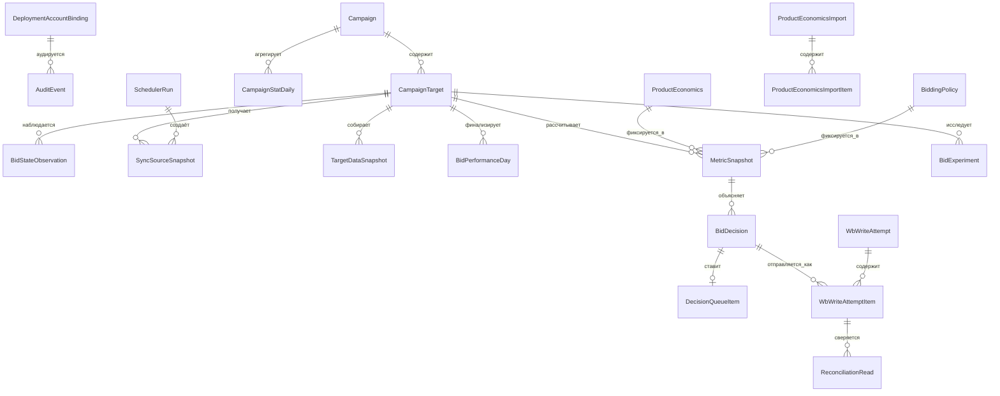
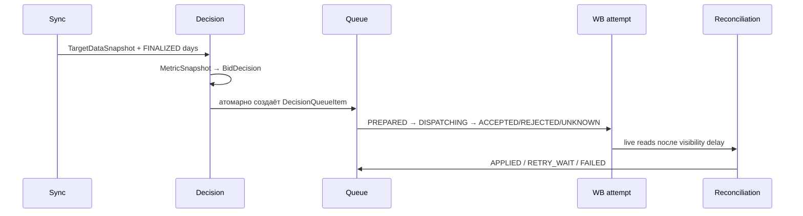

# Модель данных

Схема [`prisma/schema.prisma`](../prisma/schema.prisma) — единственный источник истины для
PostgreSQL. Она хранит бизнес-состояние, исходные данные, доказательства расчёта, решения и
попытки записи отдельно. Внутренние ключи — UUID, WB идентификаторы и деньги — `BIGINT`, даты
статистики — `DATE`, операционное время — `TIMESTAMPTZ(3)`, semantic checksums — 64-символьный
SHA-256. `Json` хранит версионированные payloads, которые нельзя без потерь выразить колонками.

Ниже слово «неизменяемый» означает, что приложение создаёт новую версию вместо изменения
семантики существующей записи; триггеры миграций дополнительно защищают snapshots, decisions,
audit и закрытые версии. Все показанные связи используют `onDelete: Restrict`: история не должна
исчезать каскадно.

## ER-поток и правила ссылочной целостности

## Перечисления

| Enum                       | Значения и смысл                                                                                                                                                                                                    |
| -------------------------- | ------------------------------------------------------------------------------------------------------------------------------------------------------------------------------------------------------------------- |
| `WbEnvironment`            | `MOCK`, `SANDBOX`, `PROD` — контур привязки аккаунта.                                                                                                                                                               |
| `WbTokenType`              | `BASE`, `PERSONAL`, `TEST` — проверенный тип WB token.                                                                                                                                                              |
| `CampaignBidType`          | `MANUAL`, `UNIFIED`, `UNKNOWN`; `CampaignPaymentType` — `CPM`, `CPC`, `UNKNOWN`.                                                                                                                                    |
| `CampaignTargetKind`       | `CARD` или `CLUSTER`; `CampaignPlacement` — `COMBINED`, `SEARCH`, `RECOMMENDATIONS`.                                                                                                                                |
| `ClusterBidState`          | `EXPLICIT`, `ABSENT`, `UNKNOWN` — состояние cluster override.                                                                                                                                                       |
| `PerformanceDayStatus`     | `DRAFT`, `FINALIZED`, `SUPERSEDED`, `INVALID` — зрелость дневных данных.                                                                                                                                            |
| `ExternalWriteControlMode` | `EXCLUSIVE` либо `SHARED`: нужен для доказательства непрерывности наблюдения.                                                                                                                                       |
| `ProductEconomicsSource`   | `MANUAL` или `IMPORT`; `ImportStatus` — `QUEUED`, `PROCESSING`, `COMPLETED`, `COMPLETED_WITH_ERRORS`, `FAILED`; `ImportItemStatus` — `PENDING`, `PROCESSING`, `VALIDATED`, `SUCCEEDED`, `FAILED`.                   |
| `PolicyScope`              | `DEPLOYMENT`, `CAMPAIGN`, `TARGET`; `ExecutionMode` — `APPLY` или `OBSERVE_ONLY`.                                                                                                                                   |
| `DecisionAction`           | `NO_CHANGE`, `INCREASE`, `DECREASE`, `RESTORE_ABSENT_OVERRIDE`, `BLOCKED`.                                                                                                                                          |
| `ExperimentStatus`         | `PLANNED`, `ACTIVE`, `COLLECTING`, `EVALUATING`, `REVERTING`, `ACCEPTED`, `REVERTED`, `REVERT_CONSTRAINED`, `FAILED`, `FAILED_REVERT_BLOCKED`, `CANCELLED`.                                                         |
| `DecisionQueueStatus`      | `QUEUED`, `LEASED`, `SENT`, `VERIFY_WAIT`, `RETRY_WAIT`, `APPLIED`, `FAILED`, `SUPERSEDED`, `CANCELLED`.                                                                                                            |
| `WriteAttemptStatus`       | `PREPARED`, `DISPATCHING`, `ACCEPTED`, `REJECTED`, `UNKNOWN`; `WriteAction` — `SET`/`DELETE`; `DesiredBidState` — `EXPLICIT`/`ABSENT`; `ReconciliationStatus` — `NOT_REQUIRED`, `PENDING`, `CONFIRMED`, `MISMATCH`. |
| `SchedulerRunStatus`       | `RUNNING`, `SUCCEEDED`, `PARTIAL`, `FAILED`, `DEADLINE_EXCEEDED`.                                                                                                                                                   |
| `AutomationMode`           | `DISABLED`, `OBSERVE_ONLY`, `APPLY`; действует на deployment/campaign/target.                                                                                                                                       |
| `ManualJobStatus`          | `QUEUED`, `RUNNING`, `SUCCEEDED`, `FAILED`, `CANCELLED`.                                                                                                                                                            |
| `SyncDataKind`             | `CAMPAIGN_DISCOVERY`, `CAMPAIGN_DETAILS`, `CURRENT_BID`, `MINIMUM_BID`, `CAMPAIGN_STATISTICS`, `CLUSTER_LIST`, `CLUSTER_STATISTICS`, `BID_RECOMMENDATION`, `BUDGET_DIAGNOSTIC`, `SAME_DAY_SPEND`.                   |
| `SyncSnapshotStatus`       | `COMPLETE`, `INCOMPLETE`, `INVALID`, `STALE`.                                                                                                                                                                       |

## Аккаунт, кампании и текущая конфигурация

### `DeploymentAccountBinding`

Singleton-привязка первого авторизованного WB account. Поля `sellerSid`, `wbEnvironment`,
`tokenType`, `tokenCategory`, `tokenFor`, `tokenAccessFingerprint` фиксируют идентичность и
способ доступа; `accountCurrency`, `accountTimezone`, `accountSettingsSource`,
`accountSettingsChecksum` — неизменяемые настройки. `initializedAt`, `lastValidatedAt` и
`bindingVersion` дают временную и версионную трассировку. Уникальность `(sellerSid, wbEnvironment)`
не допускает вторую запись той же идентичности в контуре.

### `Campaign`

Одна строка на WB campaign: `id`, уникальный `wbCampaignId`, WB `type`/`status`, `bidType`,
`paymentType`, `name`, `wbChangedAt`, `lastSyncedAt`. Поля capability — `supported`,
`unsupportedReason`; источник details — `detailsFetchedAt`, `detailsChecksum`, `detailsSyncRunId`.
Связи ведут к targets, daily statistics, policy, source snapshots, automation и manual jobs.
Индекс `(status, supported)` обслуживает выбор активных поддерживаемых кампаний.

### `CampaignTarget`

Target принадлежит `campaignId`. Его естественный ключ — `nmId`, `targetKind`, `placement` и,
для cluster, `normQueryWire`/`normQueryCanonical`. Кэш текущего состояния: `currentBidMinor`,
`minimumBidMinor`, `lastConfirmedAt`, `currentBidChecksum`, `currentBidSyncRunId`,
`minimumBidConfirmedAt`, `minimumBidChecksum`, `minimumBidSyncRunId`, `capability`.

Cluster-поля `clusterBidState`, `clusterBidContractVersion`, `clusterBaselineBidState`,
`clusterBaselineBidMinor`, `clusterBaselineChecksum`, `clusterOverrideOwned` позволяют безопасно
создать и вернуть override. Связи охватывают все snapshots, days, metrics, decisions,
experiments, policy, automation, jobs и reconciliation reads. Индексы `(campaignId,nmId,targetKind,placement)`
и `lastConfirmedAt` поддерживают выбор и freshness.

### `BidStateObservation`

Неизменяемое наблюдение target в момент `observedAt`: ставка/cluster state, `campaignStatus`,
`bidType`, `paymentType`, `activePlacementConfig`, `configurationChecksum`, `sourceMarker`,
`syncRunId`, `externalWriteControlMode`, `changeMarkerObserved`. Уникальность
`(targetId, observedAt, configurationChecksum)` защищает один и тот же факт; индексы target/time
и run ID нужны для построения непрерывного режима.

## Первичные статистика и evidence

### `CampaignStatDaily`

Нормализованная сырая статистика WB: ссылка `campaignId`, WB IDs `wbCampaignId`/`nmId`,
`date`, optional `placement` и query, `appType`, `dimensions`, `views`, `clicks`, `atbs`,
`orders`, `orderedUnits`, `canceled`, `spendMinor`, `attributedRevenueMinor`. Provenance:
`fetchedAt`, `sourceVersion`, `sourceChecksum`, `syncRunId`, `normalizedAggregationKind`.
Уникальный ключ `(wbCampaignId,nmId,date,sourceVersion,appType)` сохраняет версии, а не
перезаписывает поздние данные; есть индексы campaign/date и run.

### `SyncSourceSnapshot`

Универсальный append-only payload каждого вызова синхронизации: `dataKind`, optional campaign/
target, `sourceDate`, `fetchedAt`, `endpointProfile`, `sourceChecksum`, `normalizedData`,
`valid`, `invalidReason`, `syncRunId`, `createdAt`. Индексы `(dataKind,fetchedAt)`,
`(targetId,dataKind,fetchedAt)` и `syncRunId` обеспечивают доказательство свежести и диагностику.

### `TargetDataSnapshot`

Сводит пригодность target для одного sync run: `status`, `requiredSourceVersions`,
`completenessFlags`, `oldestFetchedAt`, `coherentRegimeChecksum`, `applyEligible`,
`increaseEligible`, `inputChecksum`. Последний уникален, поэтому один и тот же набор evidence
не материализуется дважды. Индексы target/time и status/time обслуживают свежие snapshots.

### `BidPerformanceDay`

Финализированный материал для оценщика: target, `wbStatisticDate`, `statisticalDayProfile`,
`confirmedBidMinor`, `placementBidState`, campaign/payment/bid type, `activePlacementConfig`,
дельты views/clicks/atbs/orders/`orderedUnits`/spend/revenue, `orderedUnitsSource`.

Границы доказательства — `coverageStartedAt`, `coverageEndedAt`, `maxObservedGapMinutes`,
`externalWriteControl`, `changeMarkerCoverage`, `sourceSnapshotReferences`. Модель зрелости:
`statisticsFinalizedAt`, `conversionLagDays`, `status`, `supersededAt`, `qualityFlags`.
`inputChecksum` и `createdAt` завершают immutable версию. Уникальность
`(targetId, wbStatisticDate, inputChecksum)` допускает новую версию при late attribution;
индекс `(targetId, wbStatisticDate, status)` даёт текущие FINALIZED дни.

## Экономика и policy

### `ProductEconomics` и импорт

`ProductEconomics` — интервальная неизменяемая версия экономики товара: `nmId`,
`effectiveFrom`, `effectiveTo`, `expectedContributionBeforeAdsMinor`, `source`,
`sourceUpdatedAt`, `sourceReference`, `version`, уникальный `mutationKey`, `inputChecksum`,
создание и actor. Уникальны `(nmId,version)`; индекс `(nmId,effectiveFrom,effectiveTo)` выбирает
действующую версию. Пересечения периодов и изменение закрытых версий блокируются БД.

`ProductEconomicsImport` хранит batch lifecycle: status/dry-run, `(idempotencyScope,
idempotencyKey)` и `requestChecksum`, counters total/processed/validated/succeeded/failed,
lease, attempts/error, timestamps, actor/correlation/reason. Индекс `(status,createdAt)` берёт
следующую работу. `ProductEconomicsImportItem` хранит `rowId`, `nmId`, `normalizedInput`,
`rowChecksum`, status/error, expected/actual/current created versions. Уникальности
`(importId,rowId)` и `(importId,nmId)` не допускают дубль строки; индексы поддерживают прогресс
и cursor-пагинацию.

### `BiddingPolicy`

Версия policy привязана к `scope`, optional `campaignId`/`targetId`, `executionMode`, JSON
`configuration`, `enabled`, `version`, интервалу `validFrom`/`validTo`, checksum, созданию и
actor. Уникальность `(scope,campaignId,targetId,version)` разрешает append-only версии;
индекс scope/owner/validity выбирает наиболее специфичную действующую policy. В `configuration`
сериализуется полный `DecisionPolicy`, описанный в [алгоритме](bidding-algorithm.md).

## Расчёт, решение и эксперимент

### `MetricSnapshot`

Неизменяемый снимок входа алгоритма: `targetId`, optional economics ID/version/contribution,
`policyId`, календарный period, JSON `metrics` и `candidateEstimates`, `completenessFlags`,
`inputSnapshotChecksum`, `inputSnapshotSchema`, `algorithmVersion`, `calculatedAt`. Уникальность
`(targetId,inputSnapshotChecksum)` даёт идемпотентность; `(targetId,calculatedAt)` — историю.

### `BidDecision`

Материализованный `DecisionResult`: UUIDv7 `id`, target, `action`, current/proposed/bounded bid,
strategy/outcome reasons, `guardrailCodes`, JSON `explanation`, metric snapshot, `policyVersion`,
`algorithmVersion`, уникальный `decisionInputChecksum`, `createdAt`. Один decision может иметь
ровно ноль или один queue item и много attempt items. Индекс target/time строит историю решений.

### `BidExperiment`

Состояние lower-only experiment: target/status, `sourceBidMinor`, `experimentBidMinor`,
`desiredRevertBidMinor`, optional `actualRevertBidMinor`; `plannedFullDays`,
`collectedEligibleDays`; `spendLimitMinor`, `spendSafetyBufferMinor`, observed/reserved spend;
start/first/last/evaluation timestamps; policy/algorithm/reason/terminal reason; ссылки на
result/start/revert decision; revert и lease timestamps; created/completed. Индекс
`(targetId,status)` находит активные эксперименты; частичный уникальный индекс миграции запрещает
более одного non-terminal experiment на target.

## Очередь, удалённая запись и сверка

### `DecisionQueueItem`

Один decision имеет уникальный `decisionId`. Строка хранит status, priority, `availableAt`,
lease, counters попыток/verification, последнюю ошибку/HTTP, sent/verified/next verification/
reconciliation deadline, stable read checksum/count/time, manual retry block, failure class и
optimistic `version`. Индексы `(status,availableAt,priority)` и `leaseUntil` поддерживают
`FOR UPDATE SKIP LOCKED`, recovery и fair dispatch.

### `WbWriteAttempt` и `WbWriteAttemptItem`

`WbWriteAttempt` — один сетевой batch: endpoint/method, correlation/WB request IDs, request
checksum, batch size, status, prepare/dispatch/complete times, latency, предзаписное состояние,
HTTP/rate headers, redacted request/response digests, error class/code. Индекс `(status,preparedAt)`
находит зависшие `PREPARED`/`DISPATCHING`.

Каждый `WbWriteAttemptItem` связывает attempt и decision, сохраняет `requestIndex`, endpoint
target key, action/desired state/sent bid/wire value, attempt number, item HTTP/error/fragment
hash, reconciliation state/timestamp, pre-write evidence и desired checksum. Уникальности
`(attemptId,decisionId)` и `(decisionId,attemptNumber)` защищают batch и retry; индекс
`(reconciliationStatus,reconciledAt)` выбирает ожидающие сверки.

`ReconciliationRead` — отдельный live read: attempt item/target, `readAt`, state checksum,
source marker, JSON state, classification, freshness и результат prevalidation. Индексы по
attempt/time и target/time позволяют доказать стабильное старое/желаемое/третье состояние.

## Управление, jobs, аудит и rate limits

`DeploymentControl` — singleton с `globalKill`, reason, version, updatedAt/by. `CampaignAutomation`
и `TargetAutomation` содержат уникальную связь с владельцем, `mode`, reason, version и actor/time;
наиболее строгая настройка закрывает write.

`ManualJob` хранит type/status/scope, optional campaign/target, request actor/correlation/time,
lease, completion, result/error. Индексы status/time и owner/status выбирают работу. `SchedulerRun`
фиксирует job type, start/end/deadline/status, counters/checkpoint/error summary и lease; индекс
`(jobType,status,startedAt)` — для мониторинга. `SyncCheckpoint` имеет один ключ `dataKind` и
содержит cursor, границы full pass, last success/oldest pending, processed/total и updated time.

`AuditEvent` append-only хранит actor/action/entity, before/after, correlation/causation и время;
индексы entity/time и correlation поддерживают расследование. `IdempotencyRecord` сохраняет scope,
ключ, request checksum, ответ и expiry; уникальность `(scope,idempotencyKey)` не даёт повторить
изменение с другим payload. `WbRateLimitBucket` — PostgreSQL token bucket: `bucketKey`,
`blockedUntilMs`, decimal `tokens`, `lastRefillAtMs`, `updatedAt`; таблица отображена на
`wb_rate_limit_bucket`.

## Жизненный цикл и retention

`MetricSnapshot`, `BidDecision`, evidence versions, audit и попытки не заменяются новой
информацией: новая версия получает новый checksum/ключ. Retention job удаляет только завершённые
детали write attempts после `WB_WRITE_ATTEMPT_RETENTION_DAYS`; активные, `UNKNOWN`, ожидающие
reconciliation и failed rows не удаляются. Миграции применяются до запуска bidder и никогда не
удаляют рабочие данные автоматически.

## Трассировка реализации

Схема определена в `prisma/schema.prisma`, ограничения — в `prisma/migrations/`. Репозитории
`packages/data-sync/src/repository.ts`, `packages/decision-engine/src/repository.ts` и
`packages/write-pipeline/src/repository.ts` реализуют транзакции. Инварианты покрывают
`tests/integration/data-sync*.spec.ts`, `tests/integration/decision-engine.integration.spec.ts`,
`tests/integration/write-pipeline.integration.spec.ts`, `tests/unit/decision-engine*.spec.ts` и
`tests/contract/admin-api.contract.spec.ts`.
