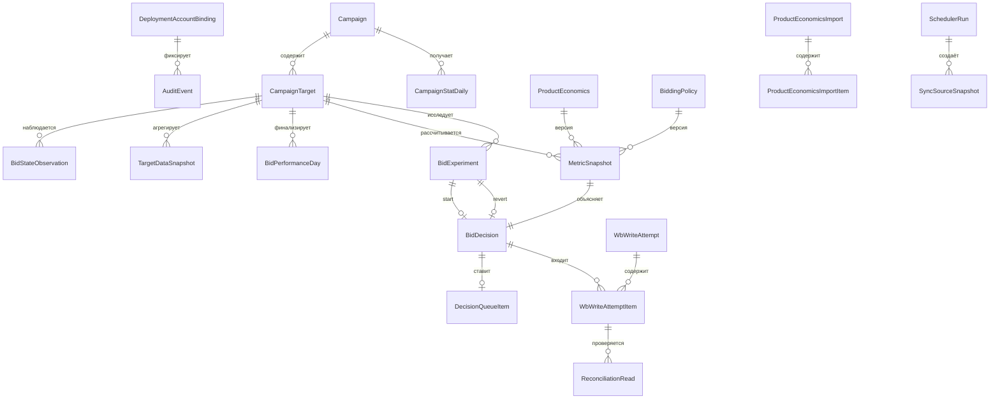

# Модель данных

PostgreSQL хранит authoritative business state. Деньги представлены `BIGINT` minor units,
идентификаторы внутренних объектов — UUID, WB identifiers — `BIGINT`, время — `TIMESTAMPTZ`.
Product economics, policy, source evidence, decisions, attempts и audit не изменяются задним
числом; новые факты создают версии или superseding rows.

## ER-модель

## Главные инварианты

- `DeploymentAccountBinding` — singleton; смена account/environment/currency/timezone запрещена.
- `Campaign.wbCampaignId` уникален; card target уникален по campaign/nm/placement.
- Каждый source read сохраняется с run ID, временем, profile, checksum и valid/invalid status.
- Только одна текущая `FINALIZED` версия performance day; late attribution supersedes её.
- `MetricSnapshot` и `BidDecision` immutable; semantic checksum обеспечивает идемпотентность.
- Decision и queue item создаются одной транзакцией; один decision имеет не более одного item.
- Один HTTP write имеет `WbWriteAttempt`, каждый batch element — отдельный attempt item.
- Audit append-only защищён trigger-ом.
- Partial unique index разрешает не более одного non-terminal experiment на target.

## Retention

Business decisions и audit сохраняются согласно утверждённой оператором политике. Завершённые
детали write attempts очищает отдельный job после `WB_WRITE_ATTEMPT_RETENTION_DAYS`; активные,
неоднозначные и не прошедшие reconciliation строки не удаляются. Миграции применяются отдельным
job до запуска bidder.
