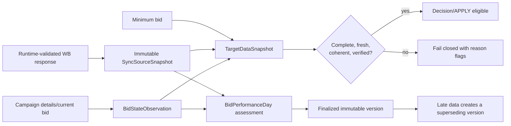

# Data synchronization and statistical evidence

The synchronization subsystem keeps fast current-state observations independent from slower
account-wide data collection. PostgreSQL is the source of truth for scheduler ownership,
checkpoints, immutable source versions, target-level completeness, and finalized statistical
evidence.

## Jobs and non-overlap

`CURRENT_STATE_SYNC` runs every 15 minutes by default with a 10-minute deadline. It discovers
campaigns, refreshes campaign details, and records current card bids. `DATA_SYNC` runs every
30 minutes and advances bounded checkpoints for minimum bids, statistics, cluster discovery,
recommendations, and diagnostic budget reads.

Each job takes a PostgreSQL session advisory lock before creating a `SchedulerRun`. Another
replica skips the same job while that lock is held. Runs persist their deadline and terminal
status; cursors advance only after a bounded page has been processed. A restarted replica
therefore resumes from durable state instead of beginning every account-wide pass again.

## Deployment account binding

The first authorized WB identity check creates the singleton `DeploymentAccountBinding`.
Subsequent starts must validate the same seller, environment, token category, currency, timezone,
and settings checksum. Only these transitions are accepted:

- validation of the current token;
- token rotation for the same identity and category;
- `BASE` to `PERSONAL` upgrade for the same seller;
- initial creation when no business history exists.

Identity replacement, environment/category drift, settings drift, and initialization over
existing business data fail closed. Every accepted transition is appended to `AuditEvent`.

## Evidence chain

A `TargetDataSnapshot` references exact checksums for campaign details, current bid, minimum bid,
and statistics. Missing, stale, invalid, or traffic-regime-incoherent evidence prevents APPLY.
Bid increases additionally require valid same-day spend evidence.

## Statistical days

Daily statistics can be normalized only under a `VERIFIED` endpoint contract. Money is converted
to integer minor units without floating-point arithmetic, and ordered units are taken from
`shks`. A day is finalized only after the conversion lag, stable repeated source reads, complete
bid/configuration coverage, bounded observation gaps, unambiguous placement attribution, and
known external-write provenance. Late attribution never mutates a finalized version: it creates
a new version linked through `supersedesId`.

Normalized search queries use Unicode NFC only. Whitespace and case are preserved. Distinct wire
values that collide after NFC are retained as invalid evidence and do not create controllable
cluster targets.

## Capacity and production gates

Work pages are bounded and reserve round-robin capacity so permanently urgent work cannot starve
the rest of the account. The load gate covers 10,000 campaigns and 100,000 targets. For the
Personal token profile, the minimum-bid endpoint has a theoretical 500-minute full-pass lower
bound; the default 720-minute SLA includes retry and jitter reserve. Current-state capacity also
checks the schedule, deadline, maximum observation gap, and freshness inequalities.

The embedded production profile currently marks fullstats money/aggregation, cluster-bid
semantics, same-day spend, and budget semantics as `UNVERIFIED`. Those responses are persisted for
diagnostics but cannot produce APPLY-eligible snapshots or finalized performance days. This is
the required fail-closed behavior until official wire evidence is recorded in a new endpoint
profile version.
