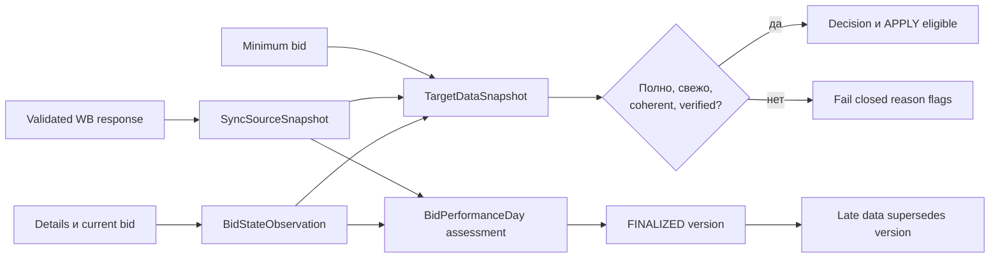

# Синхронизация данных и statistical evidence

Быстрые current-state observations отделены от медленного account-wide сбора. PostgreSQL хранит
ownership jobs, checkpoints, immutable source versions, target completeness и финализированное
evidence.

## Jobs и non-overlap

`CURRENT_STATE_SYNC` по умолчанию запускается каждые 15 минут с deadline 10 минут: обнаруживает
кампании, обновляет details и текущие card bids. `DATA_SYNC` каждые 30 минут продвигает отдельные
cursor для minimum bids, statistics, cluster discovery, recommendations и diagnostic budgets.

Перед `SchedulerRun` берётся session advisory lock. Другая реплика пропускает тот же job.
Cursor сдвигается после bounded page, поэтому restart продолжает обход. Manual resync сохраняет
те же locks и строго применяет campaign/target/data-kind scope.

## Account binding

Первый authorized WB identity check создаёт singleton `DeploymentAccountBinding`. Следующие
старты обязаны подтвердить seller, environment, token category/type, currency, timezone и
settings checksum. Разрешены validation/rotation того же token profile и односторонний
`BASE → PERSONAL` upgrade. Identity/settings drift и создание binding поверх business history
fail closed; успешные переходы добавляются в `AuditEvent`.

## Цепочка evidence

`TargetDataSnapshot` ссылается на точные checksums details/current/minimum/statistics.
Missing, stale, invalid или regime-incoherent evidence запрещает `APPLY`.

## Статистические дни

`fullstats` нормализуется только по leaf `appType → nm`; parent и child не суммируются дважды.
`sum`/`sum_price` сохраняются по profile semantics, `shks` — ordered units, `orders` остаётся
диагностикой, `canceled` сохраняет wire-значение технически недоставленных товаров.

День финализируется после conversion lag, заданного числа одинаковых reads с минимальным
временным интервалом, полного day boundary и непрерывных bid/config observations без недопустимого
gap. В `SHARED` mode требуется change-marker provenance. Late attribution создаёт новую source
version, supersedes прежний performance day и меняет downstream checksum.

## Capacity и fairness

Все запросы и DB reads bounded: campaign details/fullstats до 50 IDs, minimum bids до 100 nm,
DB page `SYNC_PAGE_SIZE`. Checkpoint хранит cursor и wrap state, priority targets добавляются без
starvation обычного round-robin.

Для 10 000 campaigns minimum-bid endpoint 20 запросов/мин и page 100 дают теоретическую нижнюю
границу 500 минут; default SLA 720 минут. Startup capacity check закрывает writes, если
настроенный SLA математически недостижим. Метрики публикуют lag, ETA и SLA violations.

Текущий production profile оставляет fullstats money/aggregation, cluster и same-day spend в
`UNVERIFIED`; read сохраняется с profile/evidence, но эти contracts не открывают write.
