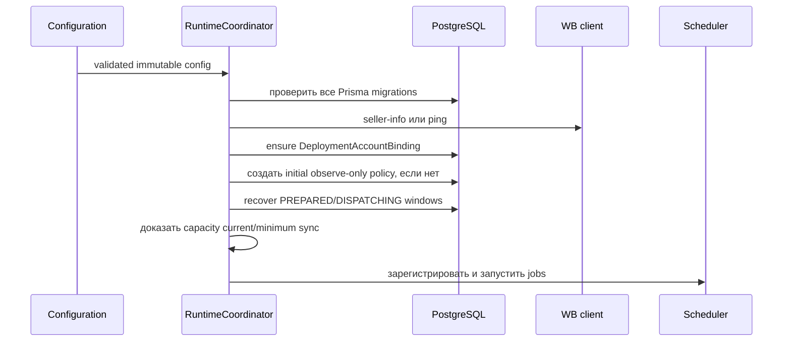

# Справочник реализации

Этот документ связывает все рабочие контуры системы с их исходниками. Он дополняет
[архитектуру](architecture.md), [карту модулей](modules.md), [алгоритм](bidding-algorithm.md) и
[модель данных](data-model.md): первые документы объясняют назначение, а этот — точный порядок
работы, границы I/O, состояния и проверки реализации.

## Процессы и композиция NestJS

В workspace два самостоятельных NestJS-приложения. `apps/bidder` — основной сервис с PostgreSQL;
`apps/wb-mock` — детерминированный HTTP mock без БД. `AppModule` собирает конфигурацию, Pino,
пул, контроллеры, runtime services, глобальный problem-details filter и DI-провайдеры пакетов.
`main.ts` создаёт приложение, включает валидацию/HTTP limits/OpenAPI и корректное завершение.

Startup bidder выполняет `RuntimeCoordinatorService` в строгой последовательности:

Если scheduler выключен, процесс может обслуживать HTTP, но integration/capacity write-gates
закрыты. Ошибка migration, identity, binding или capacity не «открывает» процессное состояние:
`RuntimeSafetyState` может только закрывать разрешение на запись.

## Конфигурация и режимы

`@wb-bidder/config` разбирает окружение Zod-схемой до запуска слушателя. Конфигурация включает:

| Группа   | Что управляет                                                                                       |
| -------- | --------------------------------------------------------------------------------------------------- |
| Аккаунт  | `DATABASE_URL`, currency, IANA timezone, Admin service token и log level.                           |
| WB       | `WB_API_MODE=mock                                                                                   | sandbox | prod`, token, безопасные origins, timeouts, max in-flight, профиль и rate-limit overrides. |
| Sync     | six-field cron, deadlines, freshness, page sizes, statistical windows/finalization и capacity SLA.  |
| Decision | scheduling и versioned policy из БД; безопасный default — observe-only.                             |
| Write    | явный `WB_API_WRITE_ENABLED`, visibility/reconciliation windows, maximum attempts, retry/retention. |
| Mock     | порт, виртуальное время, fixture и fault behaviour.                                                 |

Production URL допускает только официальный HTTPS host; userinfo, redirect, произвольный port и
перенос `Authorization` на другой origin запрещены. Token декодируется локально для проверки
claims, но identity появляется только после авторизованного WB вызова. Реальные значения не
попадают в логи: Pino redacts header/cookie/body token fields.

## HTTP: health, OpenAPI и Admin API

`HealthController` отдаёт `/health/live` без внешних вызовов и `/health/ready` с bounded
состоянием БД, migrations, binding, configuration и кэшированной integration-проверкой.
`ServiceInfoController` публикует только build/profile information. `/metrics` — Prometheus
endpoint. `openapi.ts` строит OpenAPI из Nest metadata; Swagger и JSON защищены тем же token.

`AdminAuthGuard` сравнивает Bearer token constant-time, создаёт фиксированный service principal
и требует metadata permission на каждом обработчике. `AdminController` + `AdminService` дают:

- чтение и optimistic-concurrency изменение `ProductEconomics`; одиночная запись требует
  `If-Match`, первая — `If-None-Match: *`, все mutation — `Idempotency-Key` и `changeReason`;
- асинхронный batch import до 10 000 строк с row-level результатами;
- создание/активацию append-only `BiddingPolicy`, настройки automation и global kill;
- bounded manual jobs, чтение решений, queue failures, retry только при безопасной
  classification, audit и cursor pagination (`limit=1..500`);
- RFC 9457 `application/problem+json`: `ProblemDetailsFilter` добавляет correlation ID и
  не раскрывает DB/internal details.

Административный запрос не вызывает WB синхронно. Он меняет durable данные; последующие jobs
проходят sync → decision → queue → write pipeline.

## Планировщик, синхронизация и evidence

`SchedulerService` поддерживает six-field cron, bounds deadline и graceful stop. Он запускает
независимые current-state, data-sync, decision, write, verify/reconcile, experiment и retention
callbacks. Каждая работа получает cancellation signal; repository создаёт `SchedulerRun` и
PostgreSQL advisory lock, поэтому другая replica пропускает тот же job.

`WbDataSyncWorker` выполняет два контура.

1. `CURRENT_STATE_SYNC` получает campaign count, пагинирует details (до 50 IDs), materializes
   card current bid и, только для VERIFIED profile, cluster bid. Numeric checkpoint хранит
   cursor/wrap; source и observation пишутся с run ID.
2. `DATA_SYNC` отдельно двигает checkpoints minimum bids, campaign/cluster statistics,
   recommendations, diagnostics и same-day spend. Размеры запросов ограничены профилем; ответ
   проходит Zod validation, нормализацию и checksum до persistence.

`evidence.ts` отделяет raw source от пригодного решения. `SyncSourceSnapshot` хранит каждый
ответ; `TargetDataSnapshot` проверяет требуемые источники, возраст, coherent regime и
`applyEligible`/`increaseEligible`. `BidPerformanceDay` финализируется после conversion lag,
полного coverage и нужного числа стабильных reads; поздние данные создают superseding version.
В режиме `SHARED` требуются change markers. Capacity расчёт доказывает, может ли аккаунт
уложиться в current/minimum SLA; иначе runtime закрывает writes, но не чтение.

## Decision и experiments

`DecisionJobService` читает PostgreSQL стабильными страницами по 500 targets. Для каждого target
он разрешает наиболее специфичную policy и economics, загружает только нужное окно performance
days, строит `DecisionInput`, запускает чистый `decideBid` и атомарно сохраняет
`MetricSnapshot` + `BidDecision` + допустимый `DecisionQueueItem`. Исключение в одном target
учитывается как skipped и не останавливает страницу. Сервис не выполняет WB network calls.

Exploration — отдельный lower-only путь: при подходящей policy создаётся plan, а старт/revert
становятся обычными решениями в той же очереди. `ExperimentRuntimeService` lease-ит активные
experiments, продвигает состояния от фактических evidence и не обходит validator, limiter,
visibility или reconciliation.

Подробная математика, PAVA, candidates, budget reserve и guardrails находятся в
[документе алгоритма](bidding-algorithm.md).

## Клиент WB API

`@wb-bidder/wb-api` изолирует единственный внешний I/O boundary. `endpoint-registry.ts` задаёт
разрешённые method/path/capability pairs; deprecated path никогда не может быть вызван напрямую.
`schemas.ts` проверяет каждую wire-модель; `money.ts` переводит decimal в точные minor units;
`token.ts` проверяет profile/claims; `transport.ts` сохраняет, был ли установлен TCP/TLS — это
необходимо для классификации pre-byte retry.

Перед каждым запросом `WbApiClient` проверяет origin, admission двухуровневого limiter и
in-flight semaphore. Read/verify используют bounded exponential backoff с jitter. `401` и
auth-classified `403` открывают breaker; `400/422` terminal; `429` и `Retry-After` замораживают
bucket; timeout/reset после потенциальной передачи байтов становится `UNKNOWN`, а не blind retry.
Профиль и runtime headers могут только ужесточать лимит. Card/cluster write reservation
одноразовая и освобождается в `finally`.

## Durable write pipeline

`WriteRuntimeService` создаёт executor для card write, cluster set и cluster delete. Каждый
`WriteExecutor` делает следующее:

1. lease-ит до 50 queue items через `FOR UPDATE SKIP LOCKED` и отделяет несовместимые endpoint;
2. формирует homogeneous batch по bid type/payment/action;
3. читает live state, выполняет `DatabasePreDispatchValidator` и возвращает lease при проблеме;
4. резервирует rate-limit slot, проверяет возраст live state;
5. в транзакции создаёт `WbWriteAttempt`/items и фиксирует `DISPATCHING` до сети;
6. вызывает gateway и записывает per-item result без влияния соседнего элемента.

`PREPARED` без dispatch commit безопасно отменяется при recovery. Зависший `DISPATCHING` всегда
становится `UNKNOWN`. После visibility delay verifier читает live state, классифицирует
desired/stable-old/third/inconclusive и сохраняет `ReconciliationRead`. Stable old требует
нескольких разнесённых fresh reads и вновь валидируется до bounded retry. Third state и deadline
заканчиваются `FAILED`; terminal attempts чистятся retention job. Полная state machine и поля
описаны в [конвейере записи](write-pipeline.md) и [модели данных](data-model.md).

## Детерминированный WB mock

Mock требует `Authorization: mock-test-token` на WB-совместимых путях. `MockStateService` хранит
кампании, card/cluster bids, planned delayed visibility, quota counters, виртуальные часы и
request journal. `/__mock` управляет reset, fixtures, time advance, faults, quotas и состоянием.
`PromotionController` реализует профильный subset API; exception filter формирует WB-подобные
ошибки и `429` headers. Это не упрощённый unit fake: виртуальное время материализует daily data,
conversion lag и delayed write effects, поэтому E2E не ждут реальных суток.

## Наблюдаемость, безопасность и эксплуатация

`ObservabilityService` публикует bounded-label метрики jobs, sync lag/ETA, decisions, queue,
attempts, reconciliation, limiter, breakers, imports, experiments, readiness и global kill.
В labels нет seller/campaign/target IDs или значений экономики. Логи JSON содержат correlation ID,
но credentials redacted; `AuditEvent` хранит business before/after отдельно.

Операционный порядок: при WB outage не открывать retries после неопределённой записи; при DB
outage readiness падает, scheduler останавливается; при `429` limiter уважает server freeze;
при stuck queue сначала проверить lease/attempt/reconciliation; глобальный kill закрывает write,
но оставляет sync/diagnostics. Конкретные команды восстановления, rollback и shutdown — в
[runbook](runbook.md). Security gates, secret handling и container policy — в [security](security.md).

## Поставка, Compose и проверки

`Dockerfile` собирает bidder, `Dockerfile.mock` — mock, оба исполняются non-root. Compose имеет
три независимых топологии: production read-only без mock (`docker-compose.yml`), полный
PostgreSQL+mock контур (`docker-compose.mock.yml`) и mock-only (`docker-compose.mock-only.yml`).
`.env.example` содержит только placeholder values; production write остаётся выключенной до
явных safe gates.

`pnpm run quality` объединяет Prettier, ESLint/JSDoc, TypeScript, script syntax, unit/golden/
OpenAPI/contract тесты, Prisma validation и profile/deprecated-endpoint checks. Отдельные suites
покрывают integration, E2E, load, runbook, property и mutation. Scripts проверяют документацию,
секреты, profile fixtures, container policy, Compose и built images. Матрица AC/DoD отделяет
локальные доказательства от внешних предпосылок; актуальное состояние хранится в
[acceptance evidence](acceptance-evidence.md) и [реестре расхождений](implementation-deviations.md).

## Навигация по исходникам

| Аспект          | Основные исходники                                                            | Проверки                                                          |
| --------------- | ----------------------------------------------------------------------------- | ----------------------------------------------------------------- |
| Startup/runtime | `apps/bidder/src/runtime-*.ts`, `app.module.ts`, `main.ts`                    | `production-runtime.integration.spec.ts`, `runtime-clock.spec.ts` |
| HTTP/Admin      | `admin.controller.ts`, `admin.service.ts`, `admin-*.ts`, `problem-details.ts` | `admin-api.contract.spec.ts`, OpenAPI tests                       |
| Sync/evidence   | `packages/data-sync/src/*`                                                    | `data-sync*.spec.ts`, load sync capacity                          |
| Decision        | `packages/decision-engine/src/*`, `decision-job.service.ts`                   | unit/golden/property/mutation/integration                         |
| WB transport    | `packages/wb-api/src/*`                                                       | `wb-api.spec.ts`, rate-limiter integration                        |
| Write/reconcile | `packages/write-pipeline/src/*`, `write-runtime.service.ts`                   | write pipeline integration/E2E/runbook                            |
| Mock            | `apps/wb-mock/src/*`                                                          | mock contract/OpenAPI/E2E                                         |
| Delivery        | `Dockerfile*`, `docker-compose*.yml`, `scripts/*`                             | compose/built/container/secret/docs checks                        |
